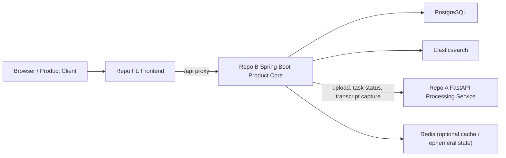

# System Context

## Purpose

AI Knowledge Workspace is a search-first system for helping a learner recover the relevant segment of previously consumed long-form learning media. The current implemented baseline is intentionally narrow, centered on lecture video, and explicitly pre-AI-expansion.

## Current System View

## Main Components

- Browser / product client: authenticates, manages workspaces, uploads lecture media, checks processing progress, searches within a workspace, and reviews transcript segments.
- Repo FE frontend: product UI that talks only to Spring Boot through `/api`.
- Spring Boot product core: product-facing backend and primary system entry point.
- FastAPI AI processing service: internal dependency for media processing and transcript production, currently living in a separate repository.
- PostgreSQL: system of record for users, workspaces, assets, transcript snapshots, and other domain data.
- Elasticsearch: product search layer for filtered transcript-row retrieval.
- Redis: optional support for cache or short-lived state; not a system of record.

## Boundary Notes

- All client-facing APIs should enter through Spring Boot.
- Workspace is a logical container owned by one user, not a collaboration space.
- FastAPI is an internal processing dependency, not the product core backend.
- Search remains lexical and product-owned in the current baseline.
- Search results must respect user and workspace boundaries.
