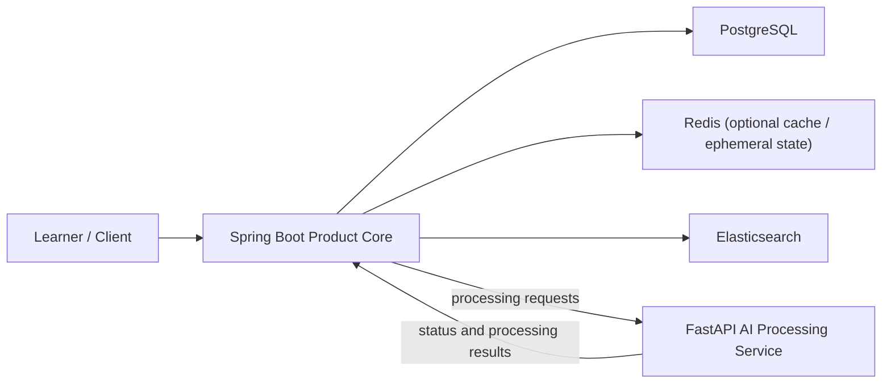

# System Context

## Purpose

AI Knowledge Workspace is a search-first system for helping a learner recover the relevant segment of previously consumed long-form learning media. Phase 1 is intentionally narrow and centered on lecture video. Audio may be supported later as stretch scope, but it is not the primary promise.

## Phase 1 System View

## Main Components

- Learner / client: uploads lecture media, checks processing progress, searches within a workspace, and reviews matching transcript segments.
- Spring Boot product core: product-facing backend and primary system entry point.
- FastAPI AI processing service: internal dependency for media and AI processing, currently living in a separate repository.
- PostgreSQL: system of record for users, workspaces, assets, authorization-relevant metadata, and other domain data.
- Elasticsearch: target search layer for transcript chunk retrieval and filtered search.
- Redis: optional support for cache or short-lived state; not a system of record.

## Boundary Notes

- All client-facing APIs should enter through Spring Boot.
- Workspace in phase 1 is a logical container owned by one user, not a collaboration space.
- FastAPI is an internal processing dependency, not the product core backend.
- Search results must respect user and workspace boundaries.
