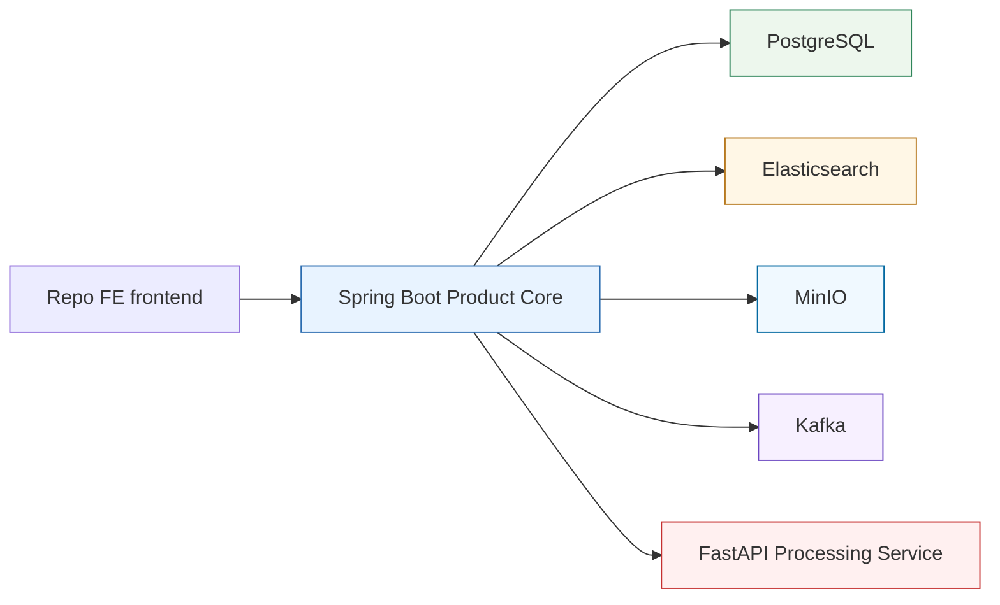

# Service Boundaries

## Boundary Summary

The current pre-AI baseline separates product logic from internal AI/media processing. Spring Boot is the product core. FastAPI is an internal processing service. Elasticsearch is the search layer. PostgreSQL is the domain data store, MinIO stores raw media bytes behind Spring, and Kafka is local event transport for opt-in outbox publishing plus future processing-result consumption.

P3-BE0 adds an evidence-based backend modularity baseline in
[`backend-modularity-baseline.md`](backend-modularity-baseline.md). It maps the
current Spring package roots, dependency directions, confirmed boundary risks,
and a staged Spring Modulith/ArchUnit adoption path before any Java package
refactor or dependency addition.

P3-BE1 adds the first test-enforced Spring Modulith baseline without changing
production behavior. It uses default direct-package detection and compares the
real `detectViolations()` report to a committed baseline resource. That baseline
is intentionally a ratchet, not a green strict verification: the known
asset/processing/search/workspace cycle and common/outbox ownership issues still
block strict `ApplicationModules.verify()`. P3-BE2 should target the smallest
boundary extraction justified by that evidence, starting with asset public APIs
for transcript/searchability reads and processing-result application.

## Current Boundary Diagram

## Spring Boot Product Core

### Currently Owns In This Repo

- Workspace model and workspace-scoped access rules
- Legacy session auth by default, plus an opt-in `keycloak_jwt` foundation that validates bearer JWTs and maps provider/subject identity to local `UserAccount` rows
- Explicit individual ownership policy for the current user -> workspace -> asset model
- Asset registration and product-visible asset metadata
- MinIO/S3 object-reference metadata and storage orchestration for raw uploaded media
- PostgreSQL-backed outbox event creation for durable publication intent
- Outbox relay state-machine foundation and Spring Kafka publisher adapter
- Manual processing-result event handler and durable consumed-event idempotency records
- Product orchestration across services
- Client-facing APIs
- Client-facing search API and result shaping
- Product-facing transcript reads and transcript-context responses
- Local transcript snapshot persistence
- Explicit transcript indexing into Elasticsearch
- PostgreSQL-owned search indexing jobs and metadata-only indexing outbox intent
- Disabled-by-default indexing listener foundation for `asset.indexing.requested.v1`

### Intentionally Keeps Out Of Scope For Now

- Keycloak runtime OIDC smoke and frontend bearer-token integration
- Collaboration, sharing, organization membership, enterprise roles, and broader authorization policies
- Organization, organization-membership, tenant-SaaS, or enterprise RBAC modeling

### Does Not Own

- Transcription
- Media-processing internals
- Direct public exposure of legacy search mechanics

## FastAPI AI Processing Service

### Owns

- Media ingestion for the current transitional processing trigger
- Transcription
- Processing status and processing result payloads
- Processing artifact rows until Spring retrieves and validates them into a product transcript snapshot
- Any internal AI/media-processing details still used on that side

### Does Not Own

- Authentication or user management
- Workspace ownership rules
- Authorization decisions
- Product-facing business logic
- Public product API surface
- Long-term product search contract
- Durable raw-media ownership or product metadata
- Product outbox state

## Elasticsearch Search Layer

### Owns

- Search-optimized storage for transcript-row search documents and related search metadata
- Filtered retrieval across workspace and asset metadata
- Product search retrieval over indexed transcript text

### Does Not Own

- Domain system of record responsibilities
- Business logic
- User or workspace authority
- Media processing
- Asset searchability decisions

## PostgreSQL

### Owns

- Domain metadata for workspaces, assets, processing jobs, and related product entities
- Object-storage references for raw media
- Outbox rows that record durable event publication intent
- Consumed processing-result event records used for Spring-side idempotency
- Search indexing jobs used for Spring-owned derived Elasticsearch writes
- Flyway-managed product schema for the current individual ownership model

### Does Not Own

- Primary search retrieval behavior
- Embedding or transcript-processing concerns
- Organization or tenant-platform state in this phase
- Kafka broker responsibilities or external message delivery

## Outbox / Future Kafka Boundary

### Currently Owns

- Durable `asset.processing.requested` publication intent stored in Product PostgreSQL.
- The first processing event payload contract, versioned as `event_version = 1`, including asset/workspace IDs and MinIO object references.
- Relay state transitions for due outbox rows: pending, publishing, published, retryable failure, and terminal failure.
- A small publisher abstraction with an opt-in Spring Kafka implementation.
- A Kafka event envelope containing event metadata and the existing JSON payload, without raw media bytes or secrets.
- At-least-once publication semantics from outbox relay to Kafka.
- A Spring result-event handler foundation used by both the one-shot local file command and the disabled-by-default `asset.processing.result.v1` Kafka listener.
- Result-event validation for `transcript.ready` v1 and `asset.processing.failed` v1.
- PostgreSQL-backed idempotency for consumed result events by `eventId`.
- Request/result correlation through `ProcessingJob.processingRequestEventId`, which stores the original `asset.processing.requested` event ID.
- Explicit processing trigger modes. `direct_upload` is the default product path and does not create a Kafka request outbox row; `kafka_request` is a local/manual transition mode that persists the request outbox row and does not call FastAPI direct upload.
- A disabled-by-default automatic request relay for due `asset.processing.requested` rows only. It runs only when `kafka_request`, Kafka, and `WORKSPACE_CORE_PROCESSING_REQUEST_RELAY_ENABLED=true` are all selected; it reuses the durable outbox claim/publish/retry state machine and does not relay result, indexing, or arbitrary outbox events.
- Disabled-by-default one-shot smoke commands for scoped request relay and result-file handling. The request-relay smoke command requires an explicit `asset.processing.requested` outbox event ID and relays only that selected event. These commands close the Spring application after one run and do not expose a public endpoint, scheduler, or Kafka listener.
- A disabled-by-default Kafka listener for `asset.processing.result.v1`. It is enabled only with `WORKSPACE_CORE_KAFKA_PROCESSING_RESULT_LISTENER_ENABLED=true`, uses `MANUAL_IMMEDIATE` offset acknowledgements, and handles result events through the existing `ProcessingResultEventHandler`.
- Disabled-by-default manual operator recovery commands scoped to one exact event ID: retry one durable `FAILED` consumed result event with its retained safe envelope, or requeue one stale `PUBLISHING` request outbox event back to `PENDING`.
- Durable `asset.indexing.requested` publication intent for derived search indexing when `WORKSPACE_CORE_SEARCH_INDEXING_AUTO_REQUEST_ENABLED=true`.
- A disabled-by-default automatic indexing request relay for due `asset.indexing.requested` rows only. It reuses the outbox state machine and does not relay processing request, result, or arbitrary outbox events.
- A disabled-by-default Kafka listener for `asset.indexing.requested.v1`. It loads canonical transcript snapshot rows from PostgreSQL, writes derived documents to Elasticsearch, and marks assets `SEARCHABLE` only after successful indexing.
- A disabled-by-default one-shot smoke command for relaying exactly one selected indexing outbox event ID.

### Does Not Own Yet

- Generic all-event scheduled relay execution.
- Dead-letter topic/queue routing.
- Automated recovery, broad scans, or scheduled stale-row repair for rows stuck in `PUBLISHING` after process interruption.
- Automatic retry of durable `FAILED` consumed result events.
- Kafka retry-topic framework.
- Operator-triggered exact-asset reindex, workspace-wide rebuild, and Elasticsearch reconcile workflows.

Phase 3I keeps Kafka as transport, not product truth. Spring can consume FastAPI result envelopes from `asset.processing.result.v1` through a disabled-by-default listener, but no retry topic, DLQ, scheduled relay, or recovery automation is wired. `consumed_processing_result_events` stores durable idempotency by `eventId`; product state is updated only after Spring validates the result and, for `transcript.ready`, retrieves and persists a complete transcript snapshot. Result events correlate to product state with the original `asset.processing.requested` event ID: `payload.processingRequestId` must equal `causationEventId`, and Spring loads the job by asset ID plus `ProcessingJob.processingRequestEventId`. `ProcessingJob.fastapiTaskId` remains the transitional direct-upload/FastAPI task identifier and is not used for Kafka result correlation. FastAPI direct upload remains the default product trigger in `direct_upload` mode. `kafka_request` is an explicit local/manual transition mode; it is mutually exclusive with direct upload for each upload and must be used before manually relaying request outbox rows to avoid duplicate processing.

P3-D1 adds an opt-in automatic request relay foundation. It is not a generic outbox worker: it selects a bounded batch of due `asset.processing.requested` events only, runs only with `kafka_request` and Kafka enabled, and leaves `direct_upload` unchanged. Kafka publication still happens through the existing publisher envelope and remains at-least-once; the claim/finalize/failure database updates are kept separate from the Kafka send so the scheduler does not hold a product database transaction open across the broker call.

P3-D2 `[ĐÃ SMOKE THỰC TẾ]` verifies the normal opt-in async processing path with Kafka and FastAPI/Celery: a Spring upload in `kafka_request` mode created the product asset/job/request outbox row, the automatic request relay published exactly one `asset.processing.requested` event, FastAPI consumed it and processed the MinIO-backed object through Celery/Whisper, the FastAPI result relay published one `transcript.ready` event, and the Spring automatic result listener marked the consumed event `APPLIED`, job `SUCCEEDED`, and asset `TRANSCRIPT_READY` with a Spring-owned transcript snapshot. A duplicate publication of the same result event ID was consumed as an already-applied no-op. Search indexing stayed disabled, and `direct_upload` remained the default product mode.

P3-D4 `[ĐÃ SMOKE THỰC TẾ]` verifies the fully automatic variant after a one-time local Docker bootstrap: Spring `kafka_request` upload used the automatic request relay, FastAPI consumer and Celery processed the selected MinIO-backed object, the FastAPI automatic result-relay process published the durable result outbox row, and the Spring automatic result listener applied it. No manual Spring request relay, Spring result-file handler, Spring recovery command, FastAPI one-shot result relay, or fabricated Kafka injection was used. `direct_upload` remained the default and was not exercised; indexing/search remained disabled; Kafka history, consumer groups, Docker image cache, volumes, and networks were intentionally retained after selected data cleanup.

Phase P3-B1 adds the derived search indexing foundation. The PostgreSQL transcript snapshot remains canonical. `asset_search_index_jobs` records the durable indexing state for one asset and snapshot fingerprint, and optional auto-request creation can persist an `asset.indexing.requested` outbox row in the same transaction as a stable transcript snapshot replacement. The event payload is metadata-only and does not carry transcript text. PostgreSQL prevents duplicate active indexing jobs for the same asset/fingerprint, already-indexed fingerprints are explicit-indexing no-ops, and final indexing completion rechecks the current transcript fingerprint before marking an asset `SEARCHABLE`. P3-E1 `[ĐÃ XÁC MINH TỪ CODE]` adds a separate opt-in automatic relay for due `asset.indexing.requested` outbox rows only; it does not create indexing jobs, start the listener, or relay other event types. The indexing listener is disabled by default and uses PostgreSQL product state to load rows before writing derived Elasticsearch documents. The Spring indexing write path lazily creates the configured derived transcript Elasticsearch index when absent, then replaces only the selected asset's derived documents. Search results are also gated by PostgreSQL asset searchability so stale Elasticsearch documents cannot make a non-searchable asset visible. P3-B2 runtime-smoked that listener path with one selected indexing outbox event, Kafka, Elasticsearch, and product-state search gating; P3-B2.1 runtime-smoked the same selected-event path from a fresh Elasticsearch state with no transcript index. P3-E1 has no new Elasticsearch runtime-smoke claim. Neither smoke ran FastAPI media processing.

P3-E2 `[ĐÃ SMOKE THỰC TẾ]` verifies the complete opt-in automatic chain from one normal `kafka_request` upload through processing and derived indexing. Spring automatic request relay published the durable processing request, FastAPI consumer/Celery processed the MinIO-backed object, FastAPI automatic result relay published the terminal result, Spring automatic result listener persisted the transcript snapshot, auto-request creation produced one indexing job and metadata-only `asset.indexing.requested` outbox row, Spring automatic indexing relay published it, and the indexing listener wrote Elasticsearch documents and marked the asset `SEARCHABLE`. Workspace search, asset-scoped search, and transcript context returned the selected asset; changing only that asset back to `TRANSCRIPT_READY` hid the stale Elasticsearch document through PostgreSQL product-state gating. No manual request relay, manual result relay, result-file handler, recovery command, manual indexing relay, retry topic, DLQ, reindex, rebuild, or reconcile workflow was used.

P3-F1 `[ĐÃ XÁC MINH TỪ CODE]` adds a Spring-owned retrieval-only assistant context endpoint at `POST /api/assistant/context`. It authenticates through the existing current-user mechanism, validates workspace and optional asset scope through existing product services, reuses the PostgreSQL-gated search API path, and reads canonical transcript context from Spring-owned snapshots. The response is a bounded context pack with source citations only; it does not call FastAPI, invoke an LLM provider, generate an answer, persist chat history, or add embeddings/vector storage.

Listener offset policy is intentionally simple. `APPLIED` results, duplicate already-applied results, durable `FAILED` handler outcomes, and known malformed/unsupported result events acknowledge the Kafka offset immediately on the consumer thread. Unexpected runtime or infrastructure failures are rethrown without acknowledgement so Kafka can redeliver the record. Immediate acknowledgement reduces unnecessary redelivery of earlier successfully handled records from the same poll, but the delivery model remains at-least-once overall. The default consumer group is `workspace-processing-result-v1`, and default offset reset is `latest`; local controlled runs should start the listener before publishing result events. Durable `FAILED` result rows can be retried only through the explicit operator command for one selected result event ID and retained metadata-only envelope.

Manual outbox recovery is similarly scoped. A selected request `OutboxEvent` in `PUBLISHING` can be requeued only when the exact outbox event ID is provided and the row is older than the configured minimum publishing age. The command does not publish the event; an operator must invoke the existing scoped relay separately. There is no broad stale-row scan or scheduled repair loop.

## MinIO Object Storage

### Owns

- Raw uploaded media bytes
- Optional derived artifact bytes in later phases

### Does Not Own

- Product metadata
- Workspace or asset authorization
- Public browser-facing access
- Processing job state

## Redis

### May Be Used For

- Cache
- Ephemeral coordination state
- Short-lived support data

### Does Not Own

- Durable domain records
- Search index responsibilities
- Workflow-engine responsibilities

## Boundary Rules

- Spring Boot is the only product entry point for clients.
- Keycloak may authenticate the person and issue JWTs, but Spring maps that identity to a local `UserAccount` and remains the authority for workspace and asset permissions.
- FastAPI may produce artifacts that support search, but it does not define the client-facing search contract.
- Elasticsearch supports product retrieval, but business rules remain in Spring Boot.
- MinIO stores bytes only; Spring stores and authorizes the object references in PostgreSQL.
- PostgreSQL outbox rows are durable publication intent; the Kafka publisher adapter is transport on top of that intent.
- PostgreSQL consumed-result rows are durable Spring-side idempotency state; Kafka offsets are not product state.
- PostgreSQL indexing jobs are durable product-side indexing state; Elasticsearch documents are derived data.
- Kafka transports events; it does not own product state, authorization, asset metadata, or transcript snapshots.
- Current-user entry and ownership enforcement now exist in explicit individual-first form, but broader auth/collaboration concerns remain out of scope.

Phase P3-C1 adds the Keycloak JWT identity foundation behind `WORKSPACE_CORE_SECURITY_AUTHENTICATION_MODE=keycloak_jwt`. The default remains `legacy_session`, so existing Project 2 register/login/session behavior still works without Keycloak configuration. In JWT mode, Spring validates bearer tokens as a resource server, provisions or resolves a local product user by provider plus OIDC `sub`, creates the default workspace through Spring-owned PostgreSQL state, and rejects session-only product API requests. Email is copied only as safe profile data; it is not the durable identity key. Keycloak roles are not workspace authorization authority in this phase, and no token values are persisted.

Phase P3-C2A adds only local Keycloak runtime topology. Keycloak is available through the explicit Docker Compose `keycloak` profile, uses a dedicated `keycloak-postgres` database/volume rather than Product PostgreSQL, and imports the local `workspace-dev` realm from `infra/keycloak/realm-import/` when the realm does not already exist. The import defines the public `workspace-web` client with Authorization Code + PKCE and an access-token audience mapper for `workspace-core`, but contains no users, passwords, client secrets, tokens, roles, groups, or authorization policies. Deleting/recreating Keycloak realm data is an explicit local operator action, not startup behavior.

P3-C2B `[ĐÃ SMOKE THỰC TẾ]` verifies the backend OIDC boundary with real local Keycloak runtime: the `keycloak` profile started, the `workspace-dev` realm and `workspace-web` client import worked, Authorization Code + PKCE issued signed access tokens with `workspace-core` audience, and Spring accepted the real issuer/signature/audience in `keycloak_jwt` mode. First JWT use provisioned one local `UserAccount` plus one default workspace, repeated JWT use resolved the same local product user, another real JWT user was blocked by Spring-owned workspace authorization, and legacy login/session-only identity was rejected in JWT mode. Direct grant was not used. React/Vite bearer-token integration, browser login UX, token refresh/logout UX, switching the default auth mode, removing legacy session auth, and collaboration/membership/RBAC remain future work.
