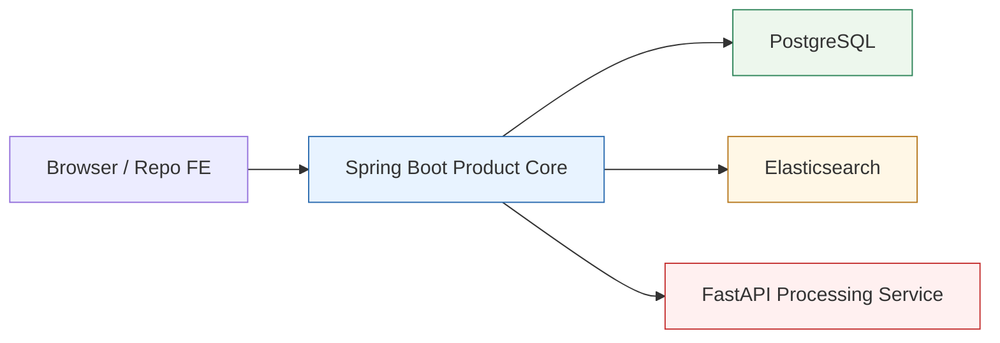

# Service Boundaries

## Boundary Summary

The current pre-AI baseline separates product logic from internal AI/media processing. Spring Boot is the product core. FastAPI is an internal processing service. Elasticsearch is the search layer. PostgreSQL is the domain data store.

## Current Boundary Diagram

## Spring Boot Product Core

### Currently Owns In This Repo

- Workspace model and workspace-scoped access rules
- Asset registration and product-visible asset metadata
- Product orchestration across services
- Client-facing APIs
- Client-facing search API and result shaping
- Product-facing transcript reads and transcript-context responses
- Local transcript snapshot persistence
- Explicit transcript indexing into Elasticsearch

### Intentionally Does Not Become Yet

- A full authentication platform
- Collaboration, sharing, roles, and broader authorization policies

### Does Not Own

- Transcription
- Media-processing internals
- Direct public exposure of legacy search mechanics

## FastAPI AI Processing Service

### Owns

- Media ingestion for processing
- Transcription
- Processing status and processing result payloads
- Any internal AI/media-processing details still used on that side

### Does Not Own

- Authentication or user management
- Workspace ownership rules
- Authorization decisions
- Product-facing business logic
- Public product API surface
- Long-term product search contract

## Elasticsearch Search Layer

### Owns

- Search-optimized storage for transcript-row search documents and related search metadata
- Filtered retrieval across workspace and asset metadata
- Product search retrieval over indexed transcript text

### Does Not Own

- Domain system of record responsibilities
- Business logic
- User or workspace authority
- Media processing

## PostgreSQL

### Owns

- Domain metadata for workspaces, assets, processing jobs, and related product entities

### Does Not Own

- Primary search retrieval behavior
- Embedding or transcript-processing concerns

## Redis

### May Be Used For

- Cache
- Ephemeral coordination state
- Short-lived support data

### Does Not Own

- Durable domain records
- Search index responsibilities
- Workflow-engine responsibilities

## Boundary Rules

- Spring Boot is the only product entry point for clients.
- FastAPI may produce artifacts that support search, but it does not define the client-facing search contract.
- Elasticsearch supports product retrieval, but business rules remain in Spring Boot.
- Current-user entry and ownership enforcement now exist in minimal form, but broader auth/collaboration concerns remain out of scope.
