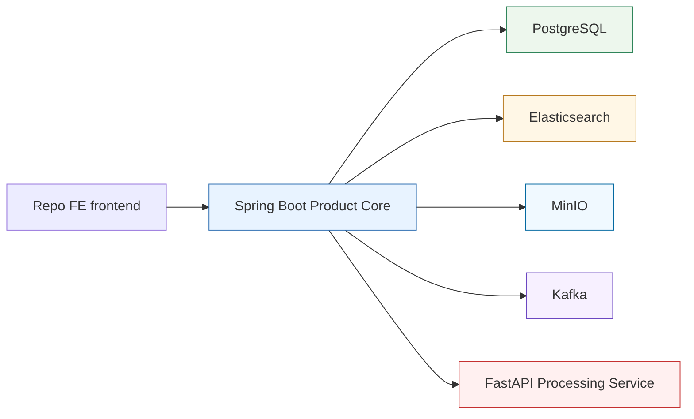

# Service Boundaries

## Boundary Summary

The current pre-AI baseline separates product logic from internal AI/media processing. Spring Boot is the product core. FastAPI is an internal processing service. Elasticsearch is the search layer. PostgreSQL is the domain data store, MinIO stores raw media bytes behind Spring, and Kafka is local event transport for opt-in outbox publishing plus future processing-result consumption.

## Current Boundary Diagram

## Spring Boot Product Core

### Currently Owns In This Repo

- Workspace model and workspace-scoped access rules
- Explicit individual ownership policy for the current user -> workspace -> asset model
- Asset registration and product-visible asset metadata
- MinIO/S3 object-reference metadata and storage orchestration for raw uploaded media
- PostgreSQL-backed outbox event creation for durable publication intent
- Outbox relay state-machine foundation and Spring Kafka publisher adapter
- Manual processing-result event handler and durable consumed-event idempotency records
- Product orchestration across services
- Client-facing APIs
- Client-facing search API and result shaping
- Product-facing transcript reads and transcript-context responses
- Local transcript snapshot persistence
- Explicit transcript indexing into Elasticsearch

### Intentionally Keeps Out Of Scope For Now

- A full authentication platform
- Collaboration, sharing, roles, and broader authorization policies
- Organization, organization-membership, tenant-SaaS, or enterprise RBAC modeling

### Does Not Own

- Transcription
- Media-processing internals
- Direct public exposure of legacy search mechanics

## FastAPI AI Processing Service

### Owns

- Media ingestion for the current transitional processing trigger
- Transcription
- Processing status and processing result payloads
- Processing artifact rows until Spring retrieves and validates them into a product transcript snapshot
- Any internal AI/media-processing details still used on that side

### Does Not Own

- Authentication or user management
- Workspace ownership rules
- Authorization decisions
- Product-facing business logic
- Public product API surface
- Long-term product search contract
- Durable raw-media ownership or product metadata
- Product outbox state

## Elasticsearch Search Layer

### Owns

- Search-optimized storage for transcript-row search documents and related search metadata
- Filtered retrieval across workspace and asset metadata
- Product search retrieval over indexed transcript text

### Does Not Own

- Domain system of record responsibilities
- Business logic
- User or workspace authority
- Media processing

## PostgreSQL

### Owns

- Domain metadata for workspaces, assets, processing jobs, and related product entities
- Object-storage references for raw media
- Outbox rows that record durable event publication intent
- Consumed processing-result event records used for Spring-side idempotency
- Flyway-managed product schema for the current individual ownership model

### Does Not Own

- Primary search retrieval behavior
- Embedding or transcript-processing concerns
- Organization or tenant-platform state in this phase
- Kafka broker responsibilities or external message delivery

## Outbox / Future Kafka Boundary

### Currently Owns

- Durable `asset.processing.requested` publication intent stored in Product PostgreSQL.
- The first processing event payload contract, versioned as `event_version = 1`, including asset/workspace IDs and MinIO object references.
- Relay state transitions for due outbox rows: pending, publishing, published, retryable failure, and terminal failure.
- A small publisher abstraction with an opt-in Spring Kafka implementation.
- A Kafka event envelope containing event metadata and the existing JSON payload, without raw media bytes or secrets.
- At-least-once publication semantics from outbox relay to Kafka.
- A manual Spring handler foundation for future `asset.processing.result.v1` consumption.
- Result-event validation for `transcript.ready` v1 and `asset.processing.failed` v1.
- PostgreSQL-backed idempotency for consumed result events by `eventId`.
- Request/result correlation through `ProcessingJob.processingRequestEventId`, which stores the original `asset.processing.requested` event ID.
- Explicit processing trigger modes. `direct_upload` is the default product path and does not create a Kafka request outbox row; `kafka_request` is a local/manual transition mode that persists the request outbox row and does not call FastAPI direct upload.
- Disabled-by-default one-shot smoke commands for scoped request relay and result-file handling. The request-relay smoke command requires an explicit `asset.processing.requested` outbox event ID and relays only that selected event. These commands close the Spring application after one run and do not expose a public endpoint, scheduler, or Kafka listener.

### Does Not Own Yet

- Scheduled relay execution.
- Automatic Kafka listener execution.
- Dead-letter topic/queue routing.
- Recovery of rows stuck in `PUBLISHING` after process interruption.
- Kafka retry-topic framework.

Phase 3D-F keeps Kafka as transport, not product truth. Spring can now parse and manually handle FastAPI result envelopes from `asset.processing.result.v1`, but no `@KafkaListener`, retry topic, or DLQ is wired. `consumed_processing_result_events` stores durable idempotency by `eventId`; product state is updated only after Spring validates the result and, for `transcript.ready`, retrieves and persists a complete transcript snapshot. Result events correlate to product state with the original `asset.processing.requested` event ID: `payload.processingRequestId` must equal `causationEventId`, and Spring loads the job by asset ID plus `ProcessingJob.processingRequestEventId`. `ProcessingJob.fastapiTaskId` remains the transitional direct-upload/FastAPI task identifier and is not used for Kafka result correlation. FastAPI direct upload remains the default product trigger in `direct_upload` mode. `kafka_request` is an explicit local/manual transition mode; it is mutually exclusive with direct upload for each upload and must be used before manually relaying request outbox rows to avoid duplicate processing.

## MinIO Object Storage

### Owns

- Raw uploaded media bytes
- Optional derived artifact bytes in later phases

### Does Not Own

- Product metadata
- Workspace or asset authorization
- Public browser-facing access
- Processing job state

## Redis

### May Be Used For

- Cache
- Ephemeral coordination state
- Short-lived support data

### Does Not Own

- Durable domain records
- Search index responsibilities
- Workflow-engine responsibilities

## Boundary Rules

- Spring Boot is the only product entry point for clients.
- FastAPI may produce artifacts that support search, but it does not define the client-facing search contract.
- Elasticsearch supports product retrieval, but business rules remain in Spring Boot.
- MinIO stores bytes only; Spring stores and authorizes the object references in PostgreSQL.
- PostgreSQL outbox rows are durable publication intent; the Kafka publisher adapter is transport on top of that intent.
- PostgreSQL consumed-result rows are durable Spring-side idempotency state; Kafka offsets are not product state.
- Kafka transports events; it does not own product state, authorization, asset metadata, or transcript snapshots.
- Current-user entry and ownership enforcement now exist in explicit individual-first form, but broader auth/collaboration concerns remain out of scope.
