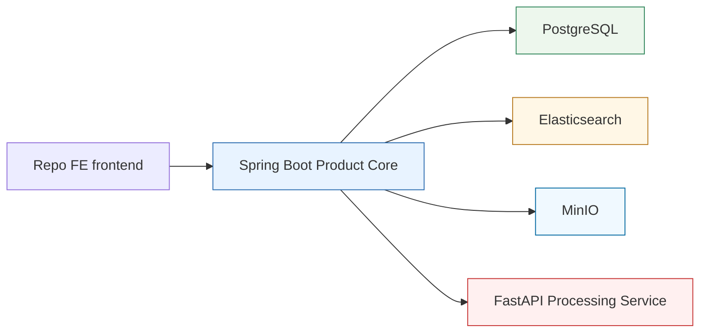

# Service Boundaries

## Boundary Summary

The current pre-AI baseline separates product logic from internal AI/media processing. Spring Boot is the product core. FastAPI is an internal processing service. Elasticsearch is the search layer. PostgreSQL is the domain data store, and MinIO stores raw media bytes behind Spring.

## Current Boundary Diagram

## Spring Boot Product Core

### Currently Owns In This Repo

- Workspace model and workspace-scoped access rules
- Explicit individual ownership policy for the current user -> workspace -> asset model
- Asset registration and product-visible asset metadata
- MinIO/S3 object-reference metadata and storage orchestration for raw uploaded media
- PostgreSQL-backed outbox event creation for durable publication intent
- Product orchestration across services
- Client-facing APIs
- Client-facing search API and result shaping
- Product-facing transcript reads and transcript-context responses
- Local transcript snapshot persistence
- Explicit transcript indexing into Elasticsearch

### Intentionally Keeps Out Of Scope For Now

- A full authentication platform
- Collaboration, sharing, roles, and broader authorization policies
- Organization, organization-membership, tenant-SaaS, or enterprise RBAC modeling

### Does Not Own

- Transcription
- Media-processing internals
- Direct public exposure of legacy search mechanics

## FastAPI AI Processing Service

### Owns

- Media ingestion for the current transitional processing trigger
- Transcription
- Processing status and processing result payloads
- Any internal AI/media-processing details still used on that side

### Does Not Own

- Authentication or user management
- Workspace ownership rules
- Authorization decisions
- Product-facing business logic
- Public product API surface
- Long-term product search contract
- Durable raw-media ownership or product metadata
- Product outbox state

## Elasticsearch Search Layer

### Owns

- Search-optimized storage for transcript-row search documents and related search metadata
- Filtered retrieval across workspace and asset metadata
- Product search retrieval over indexed transcript text

### Does Not Own

- Domain system of record responsibilities
- Business logic
- User or workspace authority
- Media processing

## PostgreSQL

### Owns

- Domain metadata for workspaces, assets, processing jobs, and related product entities
- Object-storage references for raw media
- Outbox rows that record durable event publication intent
- Flyway-managed product schema for the current individual ownership model

### Does Not Own

- Primary search retrieval behavior
- Embedding or transcript-processing concerns
- Organization or tenant-platform state in this phase
- Kafka broker responsibilities or external message delivery

## Outbox / Future Kafka Boundary

### Currently Owns

- Durable `asset.processing.requested` publication intent stored in Product PostgreSQL.
- The first processing event payload contract, versioned as `event_version = 1`, including asset/workspace IDs and MinIO object references.

### Does Not Own Yet

- Kafka producer or broker integration.
- Outbox relay scheduling, retry publishing, or dead-letter routing.
- FastAPI Kafka consumption.

Phase 3A intentionally stops at the database-backed outbox contract. FastAPI direct upload remains the current transitional processing trigger until the later async processing lifecycle replaces direct byte streaming with object-key events.

## MinIO Object Storage

### Owns

- Raw uploaded media bytes
- Optional derived artifact bytes in later phases

### Does Not Own

- Product metadata
- Workspace or asset authorization
- Public browser-facing access
- Processing job state

## Redis

### May Be Used For

- Cache
- Ephemeral coordination state
- Short-lived support data

### Does Not Own

- Durable domain records
- Search index responsibilities
- Workflow-engine responsibilities

## Boundary Rules

- Spring Boot is the only product entry point for clients.
- FastAPI may produce artifacts that support search, but it does not define the client-facing search contract.
- Elasticsearch supports product retrieval, but business rules remain in Spring Boot.
- MinIO stores bytes only; Spring stores and authorizes the object references in PostgreSQL.
- PostgreSQL outbox rows are durable intent for future message publication; they are not a Kafka implementation by themselves.
- Current-user entry and ownership enforcement now exist in explicit individual-first form, but broader auth/collaboration concerns remain out of scope.
