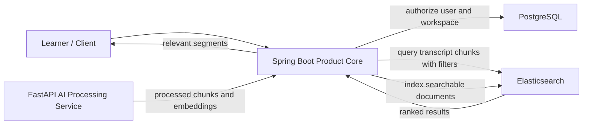

# Search Architecture

## Why Search Is Search-First

The product problem is not general conversation. The core user need is to recover the right segment from previously consumed long-form learning media. That makes retrieval the center of the product. Transcript visibility matters, but the main value is finding the relevant segment quickly.

## High-Level Retrieval Flow

## Retrieval Model

1. A user submits a search request through the product API.
2. Spring Boot validates the user, workspace, and asset scope.
3. Spring Boot queries Elasticsearch for relevant transcript chunks using search text plus metadata filters.
4. Elasticsearch returns ranked chunk results.
5. Spring Boot returns workspace-scoped results and transcript segments to the client.

FastAPI is not the synchronous query endpoint for product search. Its role is to produce processing outputs that can later be indexed and searched.

## Elasticsearch Role

Elasticsearch is the target product search layer because the product needs:

- A stable product-facing search contract
- Metadata filtering
- User and workspace scoping
- A path toward hybrid search behavior

In phase 1, the architecture should already treat Elasticsearch as the target retrieval layer even if search quality evolves over time.

## Transitional Role Of FAISS

The legacy FastAPI system may already use FAISS as part of its current processing or retrieval implementation. In AI Knowledge Workspace, FAISS should be treated as a legacy or transitional detail rather than the long-term product search contract.

This means:

- Product APIs should not depend on FAISS-specific behavior.
- Client-facing retrieval should be designed around Elasticsearch as the target layer.
- Any continued FAISS usage should remain internal to the processing side while the new product search contract is established.

## Metadata Filtering And Workspace Scope

Search results must be limited by product metadata, not just semantic similarity. At minimum, phase 1 retrieval should respect:

- User ownership
- Workspace scope
- Asset association
- Processing readiness

This keeps search aligned with the product model and prevents the search layer from becoming a separate authority over access.
