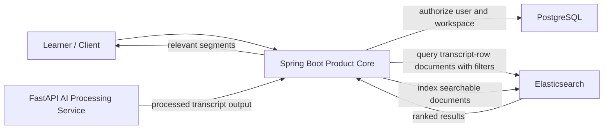
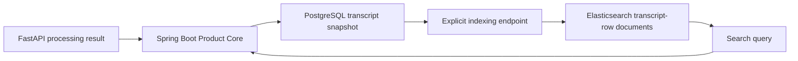

# Search Architecture

## Why Search Is Search-First

The product problem is not general conversation. The core user need is to recover the right segment from previously consumed long-form learning media. That makes retrieval the center of the product. Transcript visibility matters, but the main value is finding the relevant segment quickly.

## High-Level Retrieval Flow

## Current Search And Indexing Path

## Retrieval Model

1. A user submits a search request through the product API.
2. Spring Boot validates the user, workspace, and asset scope.
3. Spring Boot queries Elasticsearch for relevant transcript-row documents using search text plus metadata filters.
4. Elasticsearch returns ranked transcript-row results.
5. Spring Boot returns workspace-scoped results and transcript segments to the client.

FastAPI is not the synchronous query endpoint for product search. Its role is to produce processing outputs that can later be indexed and searched.

## Elasticsearch Role

Elasticsearch is the target product search layer because the product needs:

- A stable product-facing search contract
- Metadata filtering
- User and workspace scoping
- Deterministic lexical retrieval over product-owned search documents

In the current pre-AI baseline, Elasticsearch is the product retrieval layer even though search quality is still intentionally basic.

## Current Implemented Search Baseline

The current implemented search path is deliberately small:

- Spring sends one Elasticsearch lexical `multi_match` query over transcript text and asset title.
- Spring adds one small `match_phrase` boost layer for transcript text and asset title so clearer phrase-like matches can rank higher without changing the product contract.
- Search is filtered by product metadata:
  - workspace scope
  - optional asset scope
  - `SEARCHABLE` asset status
- When `assetId` is provided, Spring validates that the asset is owned by the current user and belongs to the resolved workspace before sending the Elasticsearch query.
- Results are returned as transcript-row hits, not chatbot answers.
- Tie-breaking stays deterministic when scores are equal.

This means the current search layer is product-owned and usable, but it is not a hybrid, vector, or answer-generation system.

## Transitional Role Of FAISS

If the legacy FastAPI system still uses FAISS internally, that should be treated as an internal processing-side detail rather than part of the product search contract.

This means:

- Product APIs should not depend on FAISS-specific behavior.
- Client-facing retrieval should be designed around Elasticsearch as the target layer.
- Any continued FAISS usage should remain internal to the processing side and out of reviewer-facing product claims.

## Metadata Filtering And Workspace Scope

Search results must be limited by product metadata, not just semantic similarity. At minimum, the current retrieval path should respect:

- User ownership
- Workspace scope
- Asset association
- Processing readiness

This keeps search aligned with the product model and prevents the search layer from becoming a separate authority over access.
