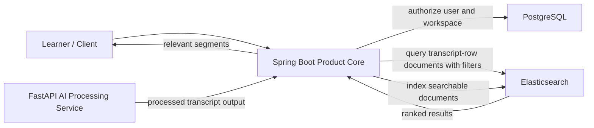
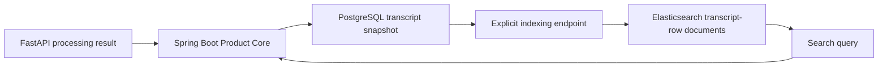

# Search Architecture

## Why Search Is Search-First

The product problem is not general conversation. The core user need is to recover the right segment from previously consumed long-form learning media. That makes retrieval the center of the product. Transcript visibility matters, but the main value is finding the relevant segment quickly.

## High-Level Retrieval Flow

```mermaid
flowchart LR
    U["Learner / Client"] --> S["Spring Boot Product Core"]
    S -->|authorize user and workspace| P["PostgreSQL"]
    S -->|query transcript-row documents with filters| E["Elasticsearch"]
    E -->|ranked results| S
    S -->|relevant segments| U
    F["FastAPI AI Processing Service"] -->|processed transcript output| S
    S -->|index searchable documents| E
```

## Current Search And Indexing Path

```mermaid
flowchart LR
    F["FastAPI processing result"] --> S["Spring Boot Product Core"]
    S --> T["PostgreSQL transcript snapshot"]
    T --> I["Explicit indexing endpoint"]
    I --> E["Elasticsearch transcript-row documents"]
    E --> Q["Search query"]
    Q --> S
```

## Retrieval Model

1. A user submits a search request through the product API.
2. Spring Boot validates the user, workspace, and asset scope.
3. Spring Boot queries Elasticsearch for relevant transcript-row documents using search text plus metadata filters.
4. Elasticsearch returns ranked transcript-row results.
5. Spring Boot returns workspace-scoped results and transcript segments to the client.

FastAPI is not the synchronous query endpoint for product search. Its role is to produce processing outputs that can later be indexed and searched.

## Elasticsearch Role

Elasticsearch is the target product search layer because the product needs:

- A stable product-facing search contract
- Metadata filtering
- User and workspace scoping
- Deterministic lexical retrieval over product-owned search documents

In the current Project3 v1 baseline, Elasticsearch is the derived product retrieval layer;
search quality remains intentionally basic and the assistant is bounded by Spring-owned
context and citation validation.

## Current Implemented Search Baseline

The current implemented search path is deliberately small:

- Spring sends one Elasticsearch lexical `multi_match` query over transcript text and asset title.
- Spring adds one small `match_phrase` boost layer for transcript text and asset title so clearer phrase-like matches can rank higher without changing the product contract.
- Search is filtered by product metadata:
  - workspace scope
  - optional asset scope
  - `SEARCHABLE` asset status
- When `assetId` is provided, Spring validates that the asset is owned by the current user and belongs to the resolved workspace before sending the Elasticsearch query.
- Results are returned as transcript-row hits, not chatbot answers.
- Tie-breaking stays deterministic when scores are equal.
- Workspace-wide search collapses Elasticsearch hits on `assetId.keyword`: at most `12` Asset
  groups are retrieved, with at most `3` canonical transcript-row candidates from each group.
  Outer group hits are not product candidates; Spring parses only the named inner hits.
- Asset-scoped search deliberately retains the flat Elasticsearch pool of `60` so one selected
  Asset can still contribute up to the public limit after adjacent-moment deduplication.
- Spring discards any returned hit outside the PostgreSQL-authorized Workspace/Asset scope
  before applying result policy. The Elasticsearch Workspace, Asset-allowlist and `SEARCHABLE`
  filters remain mandatory.
- For workspace-wide search, Spring ranks and deduplicates candidates inside each Asset, keeps
  at most `3` representatives per Asset, then flattens them in bounded rounds: every available
  first representative precedes every second representative, which precedes every third.
- Spring returns at most `12` rows. Inner-hit depth and adjacent deduplication may legitimately
  underfill that cap.
- `score` remains the raw Elasticsearch lexical score for its row. Workspace-wide public
  ordering is intentionally not globally `_score desc`; relevance ordering is deterministic
  inside each diversity round. Asset-scoped results retain the global relevance comparator.
- `resultCount` is the post-policy result size. There is no pagination or client-controlled
  result limit.

This candidate-diversity change requires no mapping change or reindex. The current search
layer remains lexical and product-owned; it is not hybrid, vector, paginated, or an
answer-generation system, and result text does not yet include a before/after context snippet.

The measured Phase 7 baseline, corpus ownership, integration command, hard invariants and
known quality gaps are recorded in
[`phase7-search-quality-baseline.md`](phase7-search-quality-baseline.md).

## Transitional Role Of FAISS

If the legacy FastAPI system still uses FAISS internally, that should be treated as an internal processing-side detail rather than part of the product search contract.

This means:

- Product APIs should not depend on FAISS-specific behavior.
- Client-facing retrieval should be designed around Elasticsearch as the target layer.
- Any continued FAISS usage should remain internal to the processing side and out of reviewer-facing product claims.

## Metadata Filtering And Workspace Scope

Search results must be limited by product metadata, not just semantic similarity. At minimum, the current retrieval path should respect:

- User ownership
- Workspace scope
- Asset association
- Processing readiness

This keeps search aligned with the product model and prevents the search layer from becoming a separate authority over access.
