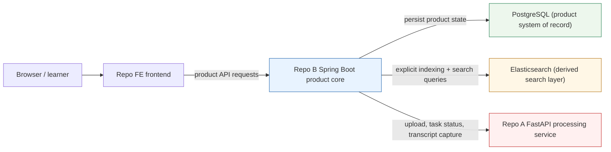
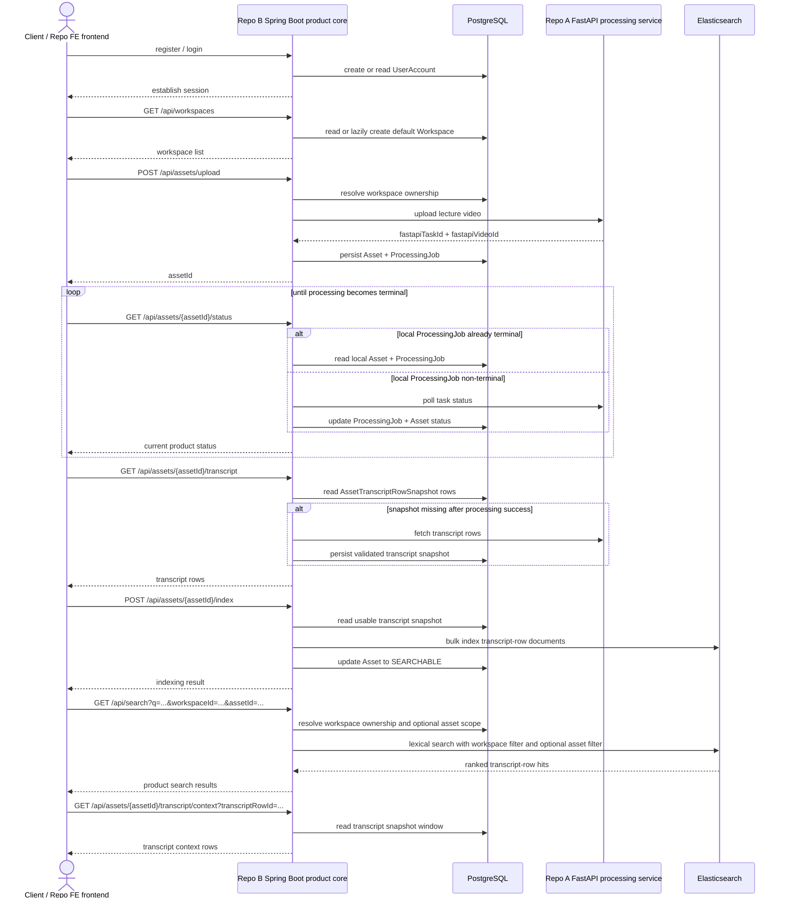
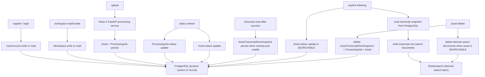
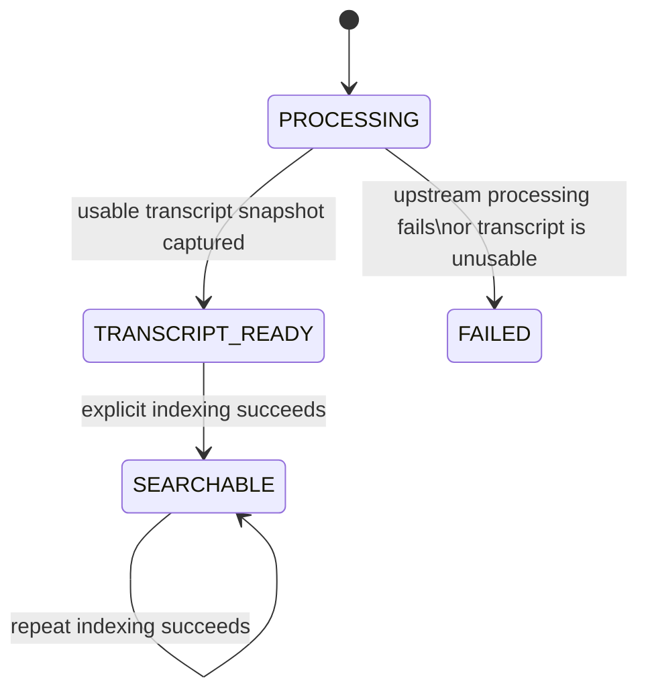
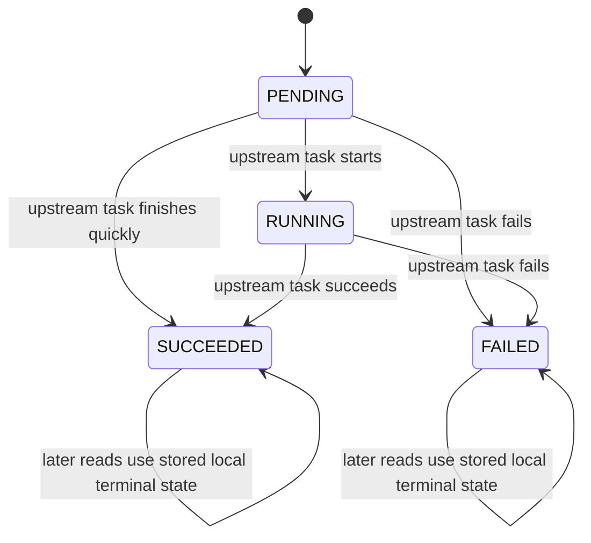

# End-To-End Diagram Pack

## Purpose

This is a reviewer-friendly current-state diagram pack for the backend baseline in Repo B.

Use it when you want one presentation-friendly document that shows:

- the current system topology
- which repo owns which responsibility
- the full user-visible golden path
- what gets written to PostgreSQL
- how Elasticsearch search becomes possible
- how the current asset and processing states move

This document is intentionally current-state only. It does not describe chatbot, RAG, vector search, collaboration, or production deployment maturity.

## 1. One-Screen System Overview

How to read this:
- Browser users interact through Repo FE.
- Repo B Spring Boot is the only product-facing backend entry point.
- Repo A FastAPI is internal processing, not the public product API.
- PostgreSQL is the product system of record.
- Elasticsearch is a derived search layer.



## 2. End-To-End Current Golden Path Sequence

How to read this:
- This is the current product-visible happy path.
- The sequence shows where state is read or written as the user moves from auth to search and transcript context.
- Transcript snapshot persistence and explicit indexing are both part of the real current flow.



## 3. Persistence And Write-Path Diagram

How to read this:
- Solid arrows show the main write path for the current baseline.
- PostgreSQL stores domain records and the local transcript snapshot.
- Elasticsearch stores only derived search documents after explicit indexing.



## 4. Search And Indexing Lifecycle

How to read this:
- FastAPI helps produce transcript data, but it is not the product-facing search endpoint.
- Search becomes possible only after transcript snapshot capture plus explicit indexing.
- Workspace scope is always enforced first, and asset scope is optional.

```mermaid
flowchart LR
    F["Repo A FastAPI processing service"] -->|processed transcript rows| S["Repo B Spring Boot product core"]
    S -->|validate usable transcript rows| T["PostgreSQL AssetTranscriptRowSnapshot"]
    T -->|explicit POST /api/assets/{assetId}/index| I["Indexing path in Repo B"]
    I -->|derived transcript-row documents| E["Elasticsearch"]

    Q["GET /api/search?q=..."] --> S
    S -->|resolve owned workspace| P["PostgreSQL workspace / asset ownership state"]
    S -->|optional assetId validation within workspace| P
    S -->|lexical search with workspace filter and optional asset filter| E
    E -->|ranked transcript-row hits| S
    S -->|product search response| Q
```

## 5. Current State Transitions

How to read this:
- The product tracks both `Asset` state and `ProcessingJob` state.
- These are related but not identical; one represents product readiness, the other represents the Spring-side view of the upstream processing task.

### 5A. Asset Lifecycle



### 5B. ProcessingJob Lifecycle



## Related Current-State Docs

- [Reviewer Overview](00-reviewer-overview.md)
- [System Context](01-system-context.md)
- [Service Boundaries](02-service-boundaries.md)
- [Search Architecture](03-search-architecture.md)
- [Current Implemented Product Flow](phase1-implemented-product-flow.md)
- [API Summary](../api/API.md)
- [Database](../data/Database.md)
