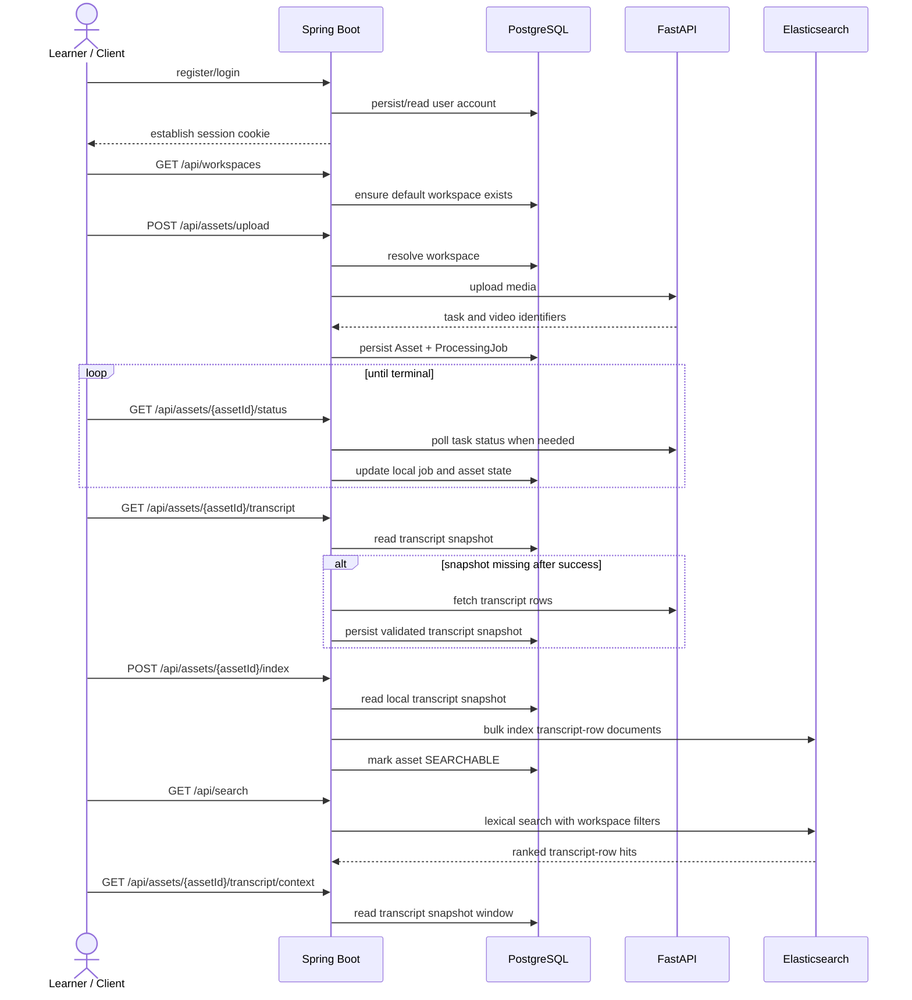

# Phase 1 Implemented Product Flow

## Purpose

This note documents the currently implemented product-side flow in Repo B. It is intentionally narrow and reflects the current Spring Boot code rather than the broader target architecture.

Despite the filename, this remains a current backend flow snapshot, not a literal "Phase 1 only" freeze. Historical phase-closure and transition notes live under `docs/planning/` and should not be treated as the current runtime contract.

For request/response details and structured error codes, use [API.md](../api/API.md). This note focuses on current runtime behavior and system flow.

## Current Implemented Product Flow

Repo A remains a separate FastAPI processing service. Repo B is the Spring Boot product core.

The currently implemented product-facing endpoints are:

- `POST /api/auth/register`
- `POST /api/auth/login`
- `POST /api/auth/logout`
- `GET /api/me`
- `POST /api/workspaces`
- `GET /api/workspaces`
- `GET /api/workspaces/{workspaceId}`
- `PATCH /api/workspaces/{workspaceId}`
- `DELETE /api/workspaces/{workspaceId}`
- `GET /api/assets`
- `GET /api/assets/{assetId}`
- `PATCH /api/assets/{assetId}`
- `DELETE /api/assets/{assetId}`
- `POST /api/assets/upload`
- `GET /api/assets/{assetId}/status`
- `GET /api/assets/{assetId}/transcript`
- `GET /api/assets/{assetId}/transcript/context`
- `POST /api/assets/{assetId}/index`
- `GET /api/search`

## Golden Path Sequence

The implemented flow is:

1. Spring exposes minimal product auth through session-based register/login/logout and `GET /api/me`.
2. Spring exposes minimal ownership-aware workspace create, list, read, rename, and conservative delete endpoints.
3. Spring creates the current user's default workspace lazily when the default scope is first needed.
4. If that default-workspace state is internally conflicted, Spring now returns an explicit integrity-style `409` instead of a vague runtime failure.
5. Spring receives a multipart upload from the client.
6. Spring resolves the requested `workspaceId`, or falls back to the current user's default workspace.
7. Spring forwards `file` and `title` to FastAPI.
8. Spring validates the live FastAPI upload response.
9. Spring persists a local `Workspace` reference on `Asset` plus the related `ProcessingJob`.
10. Spring exposes workspace-aware asset listing plus simple per-asset reads, title update, and deletion.
11. Spring exposes asset-centric status reads and performs on-demand polling when the local job is not terminal.
12. Spring captures a minimal local transcript snapshot after transcript data has been validated as usable.
13. Spring exposes transcript reads and narrow transcript-context follow-up through that local product snapshot in the normal path.
14. Spring exposes an explicit product-side indexing trigger that writes one logical Elasticsearch document per transcript row through a bulk indexing request using the local transcript snapshot.
15. Successful indexing refreshes the transcript index before returning.
16. Spring exposes a product-owned search endpoint backed by Elasticsearch.

## Current Local Persistence Model

Spring currently persists:

- `Workspace`
- `Asset`
- `ProcessingJob`
- `AssetTranscriptRowSnapshot`

`Workspace` currently stores:

- `id`
- `name`
- `ownerId`
- `defaultWorkspace`
- `createdAt`

`ProcessingJob` currently stores:

- `fastapiTaskId`
- `fastapiVideoId`
- `processingJobStatus`
- `rawUpstreamTaskState`

`AssetTranscriptRowSnapshot` currently stores:

- `assetId`
- `transcriptRowId`
- `videoId`
- `segmentIndex`
- `text`
- `createdAt`

The current transaction boundary is simple:

- Network calls to FastAPI happen outside the DB write transaction.
- DB writes are isolated in the persistence service.
- The current user's default workspace can be created lazily on first use.
- If default-workspace integrity is inconsistent, Spring fails with explicit conflict codes instead of a vague create/adopt failure.

## Current Status And Transcript Policy

Status is product-facing and asset-centric.

- Spring loads `Asset` and `ProcessingJob` by local asset ID.
- If the processing job is already terminal, Spring returns the stored local state without further upstream polling.
- If the processing job is non-terminal, Spring calls FastAPI task status and updates local state explicitly.
- Raw upstream task state is retained for debugging.

Transcript reads are also product-facing.

- Spring uses a local transcript snapshot in the normal path.
- If the snapshot is still missing after processing succeeds, Spring fetches transcript rows from FastAPI using `fastapiVideoId`, filters and validates for usable rows, persists the snapshot, then serves or indexes from that local snapshot.
- Spring only uses the currently verified transcript fields:
  - `id`
  - `video_id`
  - `segment_index`
  - `text`
  - `created_at`
- Spring does not treat task success alone as proof of usable transcript data.
- If transcript rows are empty or unusable, Spring explicitly does not treat the asset as usable.
- A usable non-empty transcript can move the asset to `TRANSCRIPT_READY`.
- Successful indexing moves the asset to `SEARCHABLE`.
- Spring also exposes a separate transcript-context endpoint for search-hit follow-up.
- Transcript context is selected by transcript row ordering on `segmentIndex`.
- If a transcript row has a real upstream `id`, context lookup matches only that `id`.
- The fallback identifier `segment-{segmentIndex}` only applies when the upstream transcript row `id` is missing.

Workspace management and asset listing are also product-facing.

- Spring exposes a minimal workspace API through `POST /api/workspaces`, `GET /api/workspaces`, `GET /api/workspaces/{workspaceId}`, `PATCH /api/workspaces/{workspaceId}`, and `DELETE /api/workspaces/{workspaceId}`.
- Workspace reads and listing stay intentionally narrow: `id`, `name`, and `createdAt`.
- Workspace rename is title/name update only.
- Workspace delete stays conservative: only non-default workspaces can be deleted, and only when they contain no assets.
- Asset listing runs through `GET /api/assets`.
- Asset listing resolves `workspaceId` and falls back to the current user's default workspace when it is omitted.
- If omitted `workspaceId` requires default-workspace resolution and that default-workspace state is conflicted, Spring returns an explicit integrity-style `409`.
- Asset listing supports small v1 pagination through `page` and `size`, plus one optional `assetStatus` filter.
- Pagination and filtering are applied within the resolved workspace scope.
- A provided unknown `workspaceId` returns a product-side `404`, and a malformed `workspaceId` returns `400`.
- For the local/dev default user path, default-workspace asset listing can still include older local assets whose workspace association is null.
- That legacy path backfills returned null-workspace assets to the current user's default workspace.
- Non-default workspace listing only returns assets already associated with that workspace.
- Asset listing uses deterministic default ordering:
  - `createdAt desc`
  - tie-break by `assetId desc`
- Asset title update runs through `PATCH /api/assets/{assetId}`.
- Title update is intentionally narrow in v1 and only allows editing the product-owned title.
- For `SEARCHABLE` assets, Spring syncs `assetTitle` in Elasticsearch before updating the local DB title.
- Asset deletion runs through `DELETE /api/assets/{assetId}`.
- Local deletion removes local transcript snapshot rows plus the linked `ProcessingJob` and `Asset`, but never deletes a `Workspace`.
- If the asset is `SEARCHABLE`, Spring deletes that asset's Elasticsearch documents before removing local DB records.
- This deletion slice does not call upstream FastAPI delete or cancel behavior.

Indexing and search are also product-facing.

- Indexing is explicit through `POST /api/assets/{assetId}/index`.
- Indexing only uses usable non-empty transcript rows.
- Indexed transcript-row documents include `workspaceId`.
- One asset indexing request now sends transcript-row documents through one Elasticsearch bulk write path.
- Repeated indexing reuses stable transcript-row document IDs for the same asset and transcript row.
- Successful indexing refreshes the transcript index before returning.
- If Elasticsearch indexing fails after transcript data is usable, Spring does not collapse the asset back to `FAILED`.
- Search runs through Spring, not FastAPI.
- Search resolves `workspaceId` and falls back to the current user's default workspace when it is omitted.
- If omitted `workspaceId` requires default-workspace resolution and that default-workspace state is conflicted, Spring returns an explicit integrity-style `409`.
- A provided unknown `workspaceId` returns a product-side `404`, and a malformed `workspaceId` returns `400`.
- Search filters on workspace scope before returning results.
- Search also supports one optional `assetId` filter inside that resolved workspace scope.
- If a provided `assetId` is unknown, not owned by the current user, or belongs to a different workspace, Spring returns the same ownership-safe `404`.
- Search only returns transcript-row documents for assets currently marked `SEARCHABLE`.
- The current search baseline is a simple Elasticsearch text query over transcript text and asset title.
- Search ordering is deterministic on score ties.

## What Is Intentionally Not Implemented Yet

- Transcript versioning or history
- Collaboration or sharing beyond the current ownership model
- Background scheduling or workflow orchestration for polling/indexing
- Search tuning beyond the current small lexical boosted-phrase baseline

## Guardrails For The Next Step

- Keep Spring as the product-facing boundary for indexing and search.
- Do not treat FastAPI `/videos/search` as the product search contract.
- Keep search results product-owned and avoid leaking raw FastAPI IDs.
- Keep transcript indexing grounded in the currently verified transcript fields.
- Avoid broad domain redesign while hardening the current flow.
