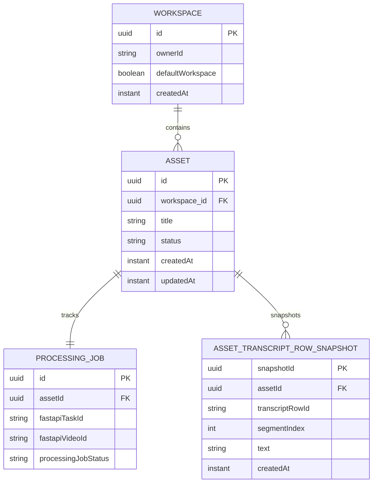
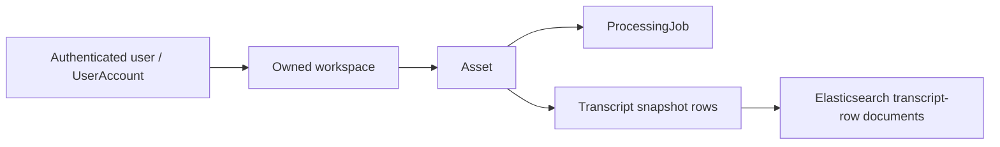

# Repo B Database

## Purpose

This document summarizes what Repo B currently persists in PostgreSQL.

- It describes current relational persistence only.
- It does not describe the Elasticsearch search index as primary application storage.
- Schema creation is now Flyway-managed for normal development and application startup.

## Schema Management

Repo B now uses Flyway migrations under `services/workspace-core/src/main/resources/db/migration`.

- `V1__create_product_schema.sql` creates the current product schema.
- Normal Spring Boot startup uses `spring.jpa.hibernate.ddl-auto=validate` by default.
- Hibernate is no longer the default schema-creation mechanism.
- `WORKSPACE_CORE_JPA_DDL_AUTO` can still override the setting for local troubleshooting, but migrations are the expected path.
- Existing local databases that were created before Flyway may need a one-time Flyway baseline or a recreated local database volume.

This phase intentionally productionizes the individual ownership model. It does not add organizations, organization memberships, tenant SaaS modeling, or RBAC tables.

## Current Relational Model

Repo B currently persists five main records:

- `UserAccount`
- `Workspace`
- `Asset`
- `ProcessingJob`
- `AssetTranscriptRowSnapshot`

## Simplified Persistence Relationship Diagram

This diagram is intentionally simplified and asset-centric. The detailed sections below are the source of truth for the current field lists and notes.

## Ownership And Derived-Data Shape

The transcript-row documents in Elasticsearch are derived search documents, not the system of record. Ownership still flows from user -> workspace -> asset in the product core.

## Current Constraints And Indexes

Flyway currently defines the following persistence guardrails:

- `user_accounts.email` is unique.
- `assets.workspace_id` references `workspaces.id`.
- `processing_jobs.asset_id` references `assets.id` and is unique, preserving the current one-job-per-asset shape.
- `asset_transcript_rows.asset_id` references `assets.id`.
- Asset and processing status columns use database check constraints for the current enum values.
- Workspace, asset, and transcript lookup paths have supporting indexes for owner/default-workspace resolution, workspace-scoped asset listing, and asset transcript-row ordering.

`workspaces.owner_id` and `assets.workspace_id` are required in the Project3 Flyway baseline. Older local databases created before this baseline should be recreated, or manually migrated and baselined once, before normal startup.

## `UserAccount`

Table: `user_accounts`

Current fields:

- `id` UUID primary key
- `email`
- `passwordHash`
- `createdAt`

Current role:

- Represents the current minimal product user record for session-based auth.
- Supports register, login, logout, and `GET /api/me`.
- Owns workspaces logically through `Workspace.ownerId`.
- Is intentionally narrow and does not introduce roles, sharing, or broader auth-platform features yet.

## `Workspace`

Table: `workspaces`

Current fields:

- `id` UUID primary key
- `name`
- `ownerId`
- `defaultWorkspace`
- `createdAt`

Current role:

- Represents the current product-side ownership container for assets.
- Supports ownership-aware workspace scoping without introducing collaboration or richer auth features yet.
- Provides one default workspace path per current user when `workspaceId` is omitted.
- Stores ownership through `ownerId` as a product-level logical link to `UserAccount`, not as a relational foreign key.
- Can be created explicitly through the current minimal workspace API, or lazily when the default workspace is first needed.
- Access decisions are centralized through a small workspace access policy and still follow the individual user -> workspace -> asset model.

## `Asset`

Table: `assets`

Current fields:

- `id` UUID primary key
- `originalFilename`
- `title`
- `status`
- `workspace_id` UUID foreign key to `workspaces`
- `createdAt`
- `updatedAt`

Current status values:

- `PROCESSING`
- `TRANSCRIPT_READY`
- `SEARCHABLE`
- `FAILED`

Current role:

- Represents the product-owned media asset record.
- Tracks the current product-side lifecycle state.
- Associates the asset with one workspace.

## `ProcessingJob`

Table: `processing_jobs`

Current fields:

- `id` UUID primary key
- `assetId` UUID
- `fastapiTaskId`
- `fastapiVideoId`
- `processingJobStatus`
- `rawUpstreamTaskState`
- `createdAt`
- `updatedAt`

Current status values:

- `PENDING`
- `RUNNING`
- `SUCCEEDED`
- `FAILED`

Current role:

- Tracks the Spring-side view of one upstream FastAPI processing task.
- Retains both upstream identifiers needed for task polling and transcript fetch.
- Keeps the raw upstream task state for debugging.

## `AssetTranscriptRowSnapshot`

Table: `asset_transcript_rows`

Current fields:

- `snapshotId` UUID primary key
- `assetId` UUID
- `transcriptRowId`
- `videoId`
- `segmentIndex`
- `text`
- `createdAt`

Current role:

- Stores the product-owned transcript snapshot for one asset.
- Persists only the currently verified transcript fields used by the product API and indexing flow.
- Supports transcript read, transcript context, and explicit indexing without requiring a fresh upstream transcript fetch in the normal path.

## Current Relationship Shape

- One `Workspace` can contain many `Asset` records.
- The current flow creates one `ProcessingJob` for one `Asset`.
- One `Asset` can have many `AssetTranscriptRowSnapshot` rows.
- The link is currently stored through `ProcessingJob.assetId`.
- The code looks up the processing job by asset ID.

## Current Write Behavior

- Workspace create persists a minimal `Workspace` row with `name`, and default-scope reads can lazily create the current user's default workspace row if it is still missing.
- Upload resolves a workspace first, then persists `Asset` and `ProcessingJob` together after FastAPI acknowledges the upload.
- On-demand status refresh can update both `ProcessingJob.processingJobStatus` and `Asset.status`.
- Transcript capture can persist local transcript snapshot rows after transcript data is validated as usable.
- Transcript read, transcript context, and explicit indexing use those local transcript rows in the normal path.
- Transcript capture can move an asset to `TRANSCRIPT_READY`.
- Empty transcript handling can move an asset to `FAILED`.
- Successful indexing can move an asset to `SEARCHABLE`.
- Asset reads and listing require an asset to belong to a workspace owned by the current user.
- Asset deletion removes local transcript snapshot rows together with the linked `ProcessingJob` and `Asset`.
- Schema drift should be handled through Flyway migrations rather than Hibernate auto-update.

## Intentionally Not Persisted Yet

- Transcript version history
- Transcript sync state beyond the current snapshot
- Workspace sharing rules
- Search history or query analytics

## Note On Elasticsearch

Elasticsearch is already used for search indexing and retrieval, but those transcript-row documents are not part of the primary relational schema described here. The current transcript-row search documents include `workspaceId` so Spring can enforce workspace-scoped search in the product API.
