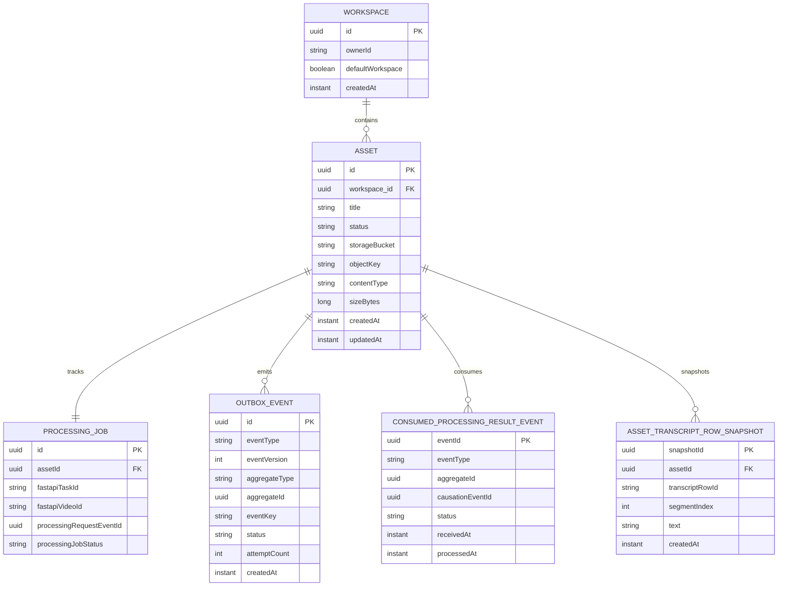
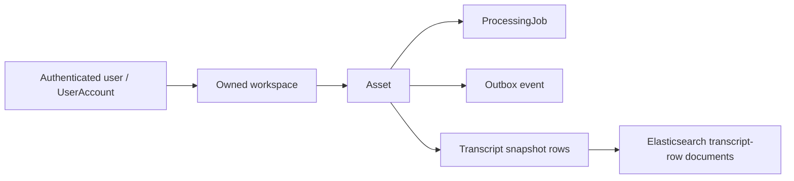

# Repo B Database

## Purpose

This document summarizes what Repo B currently persists in PostgreSQL.

- It describes current relational persistence only.
- It does not describe the Elasticsearch search index as primary application storage.
- Schema creation is now Flyway-managed for normal development and application startup.

## Schema Management

Repo B now uses Flyway migrations under `services/workspace-core/src/main/resources/db/migration`.

- `V1__create_product_schema.sql` creates the base product schema.
- `V2__add_asset_object_storage_metadata.sql` adds MinIO/S3 object-reference metadata to assets.
- `V3__add_outbox_events.sql` adds the PostgreSQL-backed outbox table for durable event publication intent.
- `V4__extend_outbox_relay_state.sql` extends the outbox status constraint for relay processing state.
- `V5__add_consumed_processing_result_events.sql` adds Spring-side idempotency records for FastAPI processing result events.
- Normal Spring Boot startup uses `spring.jpa.hibernate.ddl-auto=validate` by default.
- Hibernate is no longer the default schema-creation mechanism.
- `WORKSPACE_CORE_JPA_DDL_AUTO` can still override the setting for local troubleshooting, but migrations are the expected path.
- Existing local databases that were created before Flyway may need a one-time Flyway baseline or a recreated local database volume.

This phase intentionally productionizes the individual ownership model. It does not add organizations, organization memberships, tenant SaaS modeling, or RBAC tables.

## Current Relational Model

Repo B currently persists seven main records:

- `UserAccount`
- `Workspace`
- `Asset`
- `ProcessingJob`
- `OutboxEvent`
- `ConsumedProcessingResultEvent`
- `AssetTranscriptRowSnapshot`

## Simplified Persistence Relationship Diagram

This diagram is intentionally simplified and asset-centric. The detailed sections below are the source of truth for the current field lists and notes.



## Ownership And Derived-Data Shape



The transcript-row documents in Elasticsearch are derived search documents, not the system of record. Ownership still flows from user -> workspace -> asset in the product core.

## Current Constraints And Indexes

Flyway currently defines the following persistence guardrails:

- `user_accounts.email` is unique.
- `assets.workspace_id` references `workspaces.id`.
- `assets.storage_bucket` and `assets.object_key` are required, unique together, and point to raw media bytes in object storage.
- `assets.size_bytes` must be non-negative.
- `processing_jobs.asset_id` references `assets.id` and is unique, preserving the current one-job-per-asset shape.
- `outbox_events.status` is constrained to the current publication lifecycle values.
- `outbox_events.event_version` is required and must be greater than zero.
- `outbox_events.attempt_count` must be non-negative.
- `consumed_processing_result_events.event_id` is the durable idempotency key for consumed FastAPI result events.
- `consumed_processing_result_events.status` is constrained to the current receive/apply/failure lifecycle values.
- `asset_transcript_rows.asset_id` references `assets.id`.
- Asset and processing status columns use database check constraints for the current enum values.
- Workspace, asset, outbox, and transcript lookup paths have supporting indexes for owner/default-workspace resolution, workspace-scoped asset listing, pending outbox relay lookup, aggregate-event lookup, and asset transcript-row ordering.

`workspaces.owner_id` and `assets.workspace_id` are required in the Project3 Flyway baseline. Older local databases created before this baseline should be recreated, or manually migrated and baselined once, before normal startup.

## `UserAccount`

Table: `user_accounts`

Current fields:

- `id` UUID primary key
- `email`
- `passwordHash`
- `createdAt`

Current role:

- Represents the current minimal product user record for session-based auth.
- Supports register, login, logout, and `GET /api/me`.
- Owns workspaces logically through `Workspace.ownerId`.
- Is intentionally narrow and does not introduce roles, sharing, or broader auth-platform features yet.

## `Workspace`

Table: `workspaces`

Current fields:

- `id` UUID primary key
- `name`
- `ownerId`
- `defaultWorkspace`
- `createdAt`

Current role:

- Represents the current product-side ownership container for assets.
- Supports ownership-aware workspace scoping without introducing collaboration or richer auth features yet.
- Provides one default workspace path per current user when `workspaceId` is omitted.
- Stores ownership through `ownerId` as a product-level logical link to `UserAccount`, not as a relational foreign key.
- Can be created explicitly through the current minimal workspace API, or lazily when the default workspace is first needed.
- Access decisions are centralized through a small workspace access policy and still follow the individual user -> workspace -> asset model.

## `Asset`

Table: `assets`

Current fields:

- `id` UUID primary key
- `originalFilename`
- `title`
- `status`
- `workspace_id` UUID foreign key to `workspaces`
- `storageBucket`
- `objectKey`
- `contentType`
- `sizeBytes`
- `etag`
- `createdAt`
- `updatedAt`

Current status values:

- `PROCESSING`
- `TRANSCRIPT_READY`
- `SEARCHABLE`
- `FAILED`

Current role:

- Represents the product-owned media asset record.
- Tracks the current product-side lifecycle state.
- Associates the asset with one workspace.
- Stores MinIO/S3 object-reference metadata for the uploaded raw media object.
- Does not store raw media bytes in PostgreSQL.

## `ProcessingJob`

Table: `processing_jobs`

Current fields:

- `id` UUID primary key
- `assetId` UUID
- `fastapiTaskId`
- `fastapiVideoId`
- `processingRequestEventId` nullable UUID
- `processingJobStatus`
- `rawUpstreamTaskState`
- `createdAt`
- `updatedAt`

Current status values:

- `PENDING`
- `RUNNING`
- `SUCCEEDED`
- `FAILED`

Current role:

- Tracks the Spring-side view of one upstream FastAPI processing task and its durable Kafka request correlation when present.
- `fastapiTaskId` is the transitional direct-upload/FastAPI task identifier returned by the current direct upload call.
- `processingRequestEventId` is the original Spring `asset.processing.requested` outbox event ID used to correlate later `asset.processing.result.v1` events.
- Retains upstream identifiers needed for transitional task polling and transcript fetch.
- Keeps the raw upstream task state for debugging.

## `OutboxEvent`

Table: `outbox_events`

Current fields:

- `id` UUID primary key
- `eventType`
- `eventVersion`
- `aggregateType`
- `aggregateId`
- `eventKey`
- `payload`
- `status`
- `attemptCount`
- `nextAttemptAt`
- `lastError`
- `createdAt`
- `updatedAt`
- `publishedAt`

Current status values:

- `PENDING`
- `PUBLISHING`
- `PUBLISHED`
- `FAILED`

Current role:

- Stores durable publication intent in PostgreSQL.
- Avoids a dual-write gap between product database changes and opt-in Kafka publishing.
- Currently records `asset.processing.requested` with `eventVersion = 1` when a successful upload persists an `Asset` and `ProcessingJob`.
- Provides a relay foundation that can select due pending rows, call a publisher abstraction, and update attempt/status metadata.
- Can publish to the local Kafka topic `asset.processing.requested.v1` when `WORKSPACE_CORE_KAFKA_ENABLED=true` and the relay is explicitly invoked.
- Does not schedule relay execution, consume from Kafka, route dead-letter topics, or trigger FastAPI Kafka consumption yet.
- Kafka is event transport only; PostgreSQL remains the durable outbox and product source of truth.
- Delivery remains at-least-once because a relay process can publish to Kafka and fail before recording `PUBLISHED` in PostgreSQL. Future consumers must be idempotent.
- Stores JSON payload text and never stores raw media bytes or secrets.

`eventVersion = 1` is a lightweight contract-version marker for the current `asset.processing.requested` payload. It describes the shape of the event payload, not the version of the database row, and gives future consumers a safe way to distinguish payload shapes as the processing request evolves.

This is intentionally not a schema registry, Avro/Protobuf model, or full event framework. Project3 currently needs a small integer contract marker while Spring Boot still owns the product write path and Kafka publishing remains a later phase.

## `ConsumedProcessingResultEvent`

Table: `consumed_processing_result_events`

Current fields:

- `eventId` UUID primary key
- `eventType`
- `aggregateId`
- `causationEventId`
- `receivedAt`
- `processedAt`
- `status`
- `errorDetail`
- `createdAt`
- `updatedAt`

Current status values:

- `RECEIVED`
- `APPLIED`
- `FAILED`

Current role:

- Stores Spring-side durable idempotency state for FastAPI processing result events from `asset.processing.result.v1`.
- Dedupe is keyed by the result event's `eventId`, not by an in-memory cache.
- Supports `transcript.ready` v1 and `asset.processing.failed` v1 result events for the `ASSET` aggregate.
- Records retryable handler failures without marking product state ready when transcript artifacts cannot be fetched or validated.
- Does not implement a Kafka listener, retry topic, dead-letter route, or scheduled consumer yet.

## `AssetTranscriptRowSnapshot`

Table: `asset_transcript_rows`

Current fields:

- `snapshotId` UUID primary key
- `assetId` UUID
- `transcriptRowId`
- `videoId`
- `segmentIndex`
- `text`
- `createdAt`

Current role:

- Stores the product-owned transcript snapshot for one asset.
- Persists only the currently verified transcript fields used by the product API and indexing flow.
- Supports transcript read, transcript context, and explicit indexing without requiring a fresh upstream transcript fetch in the normal path.

## Current Relationship Shape

- One `Workspace` can contain many `Asset` records.
- The current flow creates one `ProcessingJob` for one `Asset`.
- One `Asset` can have many `AssetTranscriptRowSnapshot` rows.
- The link is currently stored through `ProcessingJob.assetId`.
- The code looks up the processing job by asset ID.

## Current Write Behavior

- Workspace create persists a minimal `Workspace` row with `name`, and default-scope reads can lazily create the current user's default workspace row if it is still missing.
- Upload resolves a workspace first, stores raw media bytes in MinIO/S3-compatible object storage, then follows exactly one configured processing trigger mode.
- `workspace.processing.trigger-mode=direct_upload` is the default product path. Spring calls the transitional FastAPI direct upload endpoint, persists `Asset` and `ProcessingJob`, stores the FastAPI task/video IDs, does not create an `asset.processing.requested` outbox row, and leaves `ProcessingJob.processingRequestEventId` null.
- `workspace.processing.trigger-mode=kafka_request` is an explicit local/manual transition mode. Spring does not call FastAPI direct upload; it persists `Asset`, `ProcessingJob`, and one `asset.processing.requested` version 1 `OutboxEvent` in one transaction, with `ProcessingJob.processingRequestEventId` set to the same UUID as the outbox event ID. `fastapiTaskId` and `fastapiVideoId` remain null because no direct FastAPI task exists.
- If object storage succeeds but FastAPI direct upload or database persistence fails, Spring attempts best-effort object cleanup and does not intentionally leave a product asset row behind.
- Outbox events are created only for uploads that reach product persistence. Failed upload attempts before persistence do not intentionally create outbox rows.
- Kafka publishing from `outbox_events` is implemented as an opt-in Spring Kafka publisher adapter. The table and relay state machine remain the durable foundation for the later async processing lifecycle.
- The Phase 3C relay is disabled by default and has no scheduler. If Kafka is disabled and the relay is manually invoked, the default publisher fails clearly instead of marking rows as externally delivered.
- Request relays must not be enabled for ordinary `direct_upload` uploads. The explicit `kafka_request` trigger mode exists to prevent duplicate processing before cutover.
- Recovery for rows left in `PUBLISHING` by a process interruption is future work and should be added with the real scheduled relay/publisher phase.
- Phase 3D-D-A adds a manual Spring result-event handler for future consumption from `asset.processing.result.v1`; no automatic `@KafkaListener` is wired yet.
- `transcript.ready` handling validates the result event, requires `payload.processingRequestId == causationEventId`, loads the `ProcessingJob` by asset ID plus `processingRequestEventId`, fetches transcript artifact rows from FastAPI by `processingRequestId`, validates the complete artifact set, replaces the Spring-owned transcript snapshot, marks the processing job `SUCCEEDED`, and marks the asset `TRANSCRIPT_READY`.
- `asset.processing.failed` handling validates the same request/result correlation, marks the processing job and asset `FAILED`, and stores only bounded safe error state.
- Duplicate result events with the same `eventId` are ignored after the first successful application.
- On-demand status refresh can update both `ProcessingJob.processingJobStatus` and `Asset.status`.
- Transcript capture can persist local transcript snapshot rows after transcript data is validated as usable.
- Transcript read, transcript context, and explicit indexing use those local transcript rows in the normal path.
- Transcript capture can move an asset to `TRANSCRIPT_READY`.
- Empty transcript handling can move an asset to `FAILED`.
- Successful indexing can move an asset to `SEARCHABLE`.
- Asset reads and listing require an asset to belong to a workspace owned by the current user.
- Asset deletion removes local transcript snapshot rows together with the linked `ProcessingJob` and `Asset`.
- Schema drift should be handled through Flyway migrations rather than Hibernate auto-update.

## Intentionally Not Persisted Yet

- Transcript version history
- Transcript sync state beyond the current snapshot
- Kafka consumer state, FastAPI event-consumption state, or dead-letter routing
- Automatic Kafka listener offsets for processing result events
- Automatic recovery for stuck `PUBLISHING` outbox rows
- Workspace sharing rules
- Search history or query analytics

## Note On Object Storage

MinIO stores raw uploaded media bytes only. PostgreSQL remains the product system of record for ownership, asset metadata, object keys, processing job state, transcript snapshots, and authorization decisions.

Current raw media object keys use this convention:

```text
users/{safeUserId}/workspaces/{workspaceId}/assets/{assetId}/raw/{safeFilename}
```

The user and filename components are sanitized before use. The key includes the workspace ID and asset ID so storage objects can be traced back to product metadata without making MinIO the source of truth.

Because this is a personal Docker-first project, older local PostgreSQL volumes that contain assets without object metadata should usually be recreated after this phase instead of migrated through compatibility code.

## Note On Elasticsearch

Elasticsearch is already used for search indexing and retrieval, but those transcript-row documents are not part of the primary relational schema described here. The current transcript-row search documents include `workspaceId` so Spring can enforce workspace-scoped search in the product API.
