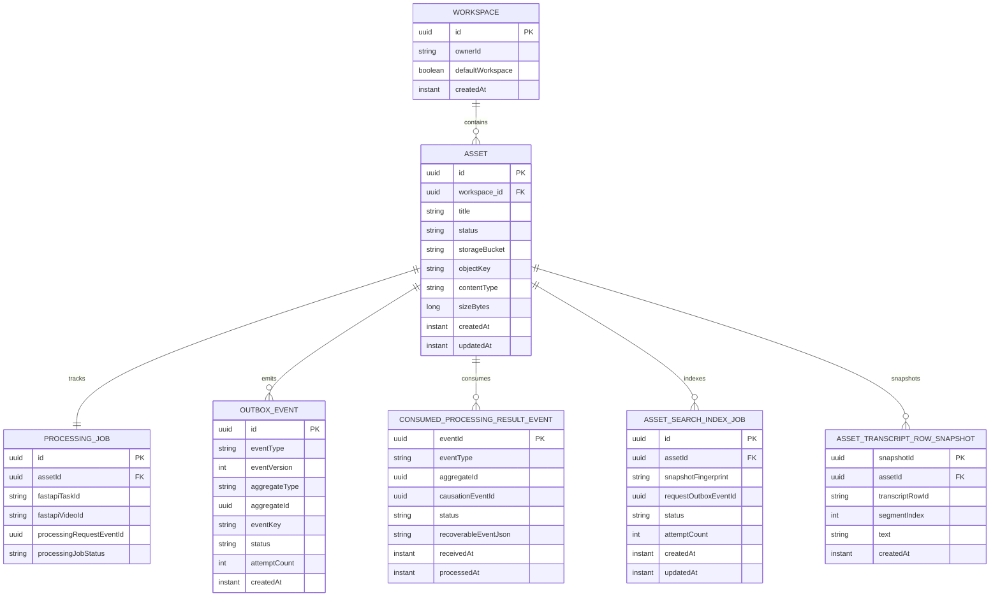
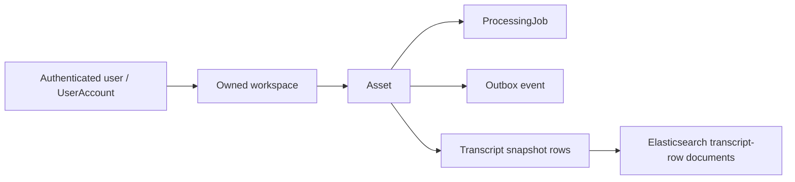

# Repo B Database

## Purpose

This document summarizes what Repo B currently persists in PostgreSQL.

- It describes current relational persistence only.
- It does not describe the Elasticsearch search index as primary application storage.
- Schema creation is now Flyway-managed for normal development and application startup.

## Schema Management

Repo B now uses Flyway migrations under `services/workspace-core/src/main/resources/db/migration`.

- `V1__create_product_schema.sql` creates the base product schema.
- `V2__add_asset_object_storage_metadata.sql` adds MinIO/S3 object-reference metadata to assets.
- `V3__add_outbox_events.sql` adds the PostgreSQL-backed outbox table for durable event publication intent.
- `V4__extend_outbox_relay_state.sql` extends the outbox status constraint for relay processing state.
- `V5__add_consumed_processing_result_events.sql` adds Spring-side idempotency records for FastAPI processing result events.
- `V6__allow_kafka_request_processing_jobs.sql` allows direct-upload task identifiers to be nullable for explicit `kafka_request` uploads.
- `V7__add_recoverable_processing_result_event_json.sql` adds bounded, metadata-only retained result envelopes for explicit manual recovery of durable failed result events.
- `V8__add_asset_search_index_jobs.sql` adds PostgreSQL-owned derived search indexing jobs.
- `V9__harden_asset_search_index_jobs.sql` adds the active-fingerprint key used to prevent duplicate active indexing jobs for the same asset and snapshot fingerprint.
- `V10__add_user_external_identity.sql` adds nullable provider/subject identity linkage for opt-in OIDC/JWT users.
- Normal Spring Boot startup uses `spring.jpa.hibernate.ddl-auto=validate` by default.
- Hibernate is no longer the default schema-creation mechanism.
- `WORKSPACE_CORE_JPA_DDL_AUTO` can still override the setting for local troubleshooting, but migrations are the expected path.
- Existing local databases that were created before Flyway may need a one-time Flyway baseline or a recreated local database volume.

This phase intentionally productionizes the individual ownership model. It does not add organizations, organization memberships, tenant SaaS modeling, or RBAC tables.

## Current Relational Model

Repo B currently persists eight main records:

- `UserAccount`
- `Workspace`
- `Asset`
- `ProcessingJob`
- `OutboxEvent`
- `ConsumedProcessingResultEvent`
- `AssetSearchIndexJob`
- `AssetTranscriptRowSnapshot`

P3-D2 `[ĐÃ SMOKE THỰC TẾ]` verified the normal opt-in async processing state transitions in Product PostgreSQL: a `kafka_request` upload created one `Asset`, one `ProcessingJob`, and one `asset.processing.requested` `OutboxEvent`; the automatic request relay marked that request outbox row `PUBLISHED`; the Spring result listener recorded one `ConsumedProcessingResultEvent` as `APPLIED`, marked the job `SUCCEEDED`, marked the asset `TRANSCRIPT_READY`, and persisted the Spring-owned transcript snapshot. Search indexing was disabled, so no `AssetSearchIndexJob` or `asset.indexing.requested` row was created for that run.

P3-D4 `[ĐÃ SMOKE THỰC TẾ]` verified the same product-state endpoint through the fully automatic path: Spring automatic request relay published the selected durable request row, FastAPI automatic result-relay published the selected durable result row after consumer/Celery processing, and Spring automatic result listener applied it. Cleanup deleted only the selected Product PostgreSQL rows, FastAPI processing rows, Redis task metadata, and selected MinIO object while retaining Kafka history and Docker cache. `direct_upload` remained the default and was not exercised; indexing/search stayed disabled.

## Simplified Persistence Relationship Diagram

This diagram is intentionally simplified and asset-centric. The detailed sections below are the source of truth for the current field lists and notes.



## Ownership And Derived-Data Shape



The transcript-row documents in Elasticsearch are derived search documents, not the system of record. Ownership still flows from user -> workspace -> asset in the product core.

## Current Constraints And Indexes

Flyway currently defines the following persistence guardrails:

- `user_accounts.email` is unique.
- `assets.workspace_id` references `workspaces.id`.
- `assets.storage_bucket` and `assets.object_key` are required, unique together, and point to raw media bytes in object storage.
- `assets.size_bytes` must be non-negative.
- `processing_jobs.asset_id` references `assets.id` and is unique, preserving the current one-job-per-asset shape.
- `outbox_events.status` is constrained to the current publication lifecycle values.
- `outbox_events.event_version` is required and must be greater than zero.
- `outbox_events.attempt_count` must be non-negative.
- `consumed_processing_result_events.event_id` is the durable idempotency key for consumed FastAPI result events.
- `consumed_processing_result_events.status` is constrained to the current receive/apply/failure lifecycle values.
- `asset_search_index_jobs.asset_id` references `assets.id`.
- `asset_search_index_jobs.status` is constrained to the current indexing lifecycle values.
- `asset_search_index_jobs.attempt_count` must be non-negative.
- `asset_search_index_jobs` has a unique `(asset_id, active_fingerprint_key)` index. The key is populated only while a job is active (`PENDING` or `INDEXING`), so PostgreSQL rejects duplicate active jobs for the same asset/fingerprint while preserving terminal job history.
- `asset_transcript_rows.asset_id` references `assets.id`.
- Asset and processing status columns use database check constraints for the current enum values.
- Workspace, asset, outbox, and transcript lookup paths have supporting indexes for owner/default-workspace resolution, workspace-scoped asset listing, pending outbox relay lookup, aggregate-event lookup, and asset transcript-row ordering.

`workspaces.owner_id` and `assets.workspace_id` are required in the Project3 Flyway baseline. Older local databases created before this baseline should be recreated, or manually migrated and baselined once, before normal startup.

## `UserAccount`

Table: `user_accounts`

Current fields:

- `id` UUID primary key
- `email`
- `passwordHash`
- `identityProvider` nullable
- `externalSubject` nullable
- `createdAt`

Current role:

- Represents the current minimal product user record for session-based auth and opt-in OIDC/JWT identity mapping.
- Supports register, login, logout, and `GET /api/me`.
- Owns workspaces logically through `Workspace.ownerId`.
- In `keycloak_jwt` mode, links a validated JWT to the local product user with provider plus OIDC `sub`; email is profile data only and is not the durable identity key.
- Does not persist Keycloak access tokens, refresh tokens, client secrets, or Keycloak role grants.
- Is intentionally narrow and does not introduce roles, sharing, organization membership, or broader auth-platform features yet.
- P3-C2B `[ĐÃ SMOKE THỰC TẾ]` verified with real local Keycloak tokens that first JWT use creates exactly one local user and default workspace, repeated JWT use resolves the same local user, and another JWT subject cannot access that user's workspace. Product PostgreSQL remains the authorization source; no token values are persisted.

## `Workspace`

Table: `workspaces`

Current fields:

- `id` UUID primary key
- `name`
- `ownerId`
- `defaultWorkspace`
- `createdAt`

Current role:

- Represents the current product-side ownership container for assets.
- Supports ownership-aware workspace scoping without introducing collaboration or richer auth features yet.
- Provides one default workspace path per current user when `workspaceId` is omitted.
- Stores ownership through `ownerId` as a product-level logical link to `UserAccount`, not as a relational foreign key.
- Can be created explicitly through the current minimal workspace API, or lazily when the default workspace is first needed.
- Access decisions are centralized through a small workspace access policy and still follow the individual user -> workspace -> asset model.

## `Asset`

Table: `assets`

Current fields:

- `id` UUID primary key
- `originalFilename`
- `title`
- `status`
- `workspace_id` UUID foreign key to `workspaces`
- `storageBucket`
- `objectKey`
- `contentType`
- `sizeBytes`
- `etag`
- `createdAt`
- `updatedAt`

Current status values:

- `PROCESSING`
- `TRANSCRIPT_READY`
- `SEARCHABLE`
- `FAILED`

Current role:

- Represents the product-owned media asset record.
- Tracks the current product-side lifecycle state.
- Associates the asset with one workspace.
- Stores MinIO/S3 object-reference metadata for the uploaded raw media object.
- Does not store raw media bytes in PostgreSQL.

## `ProcessingJob`

Table: `processing_jobs`

Current fields:

- `id` UUID primary key
- `assetId` UUID
- `fastapiTaskId`
- `fastapiVideoId`
- `processingRequestEventId` nullable UUID
- `processingJobStatus`
- `rawUpstreamTaskState`
- `createdAt`
- `updatedAt`

Current status values:

- `PENDING`
- `RUNNING`
- `SUCCEEDED`
- `FAILED`

Current role:

- Tracks the Spring-side view of one upstream FastAPI processing task and its durable Kafka request correlation when present.
- `fastapiTaskId` is the transitional direct-upload/FastAPI task identifier returned by the current direct upload call.
- `processingRequestEventId` is the original Spring `asset.processing.requested` outbox event ID used to correlate later `asset.processing.result.v1` events.
- Retains upstream identifiers needed for transitional task polling and transcript fetch.
- Keeps the raw upstream task state for debugging.

## `OutboxEvent`

Table: `outbox_events`

Current fields:

- `id` UUID primary key
- `eventType`
- `eventVersion`
- `aggregateType`
- `aggregateId`
- `eventKey`
- `payload`
- `status`
- `attemptCount`
- `nextAttemptAt`
- `lastError`
- `createdAt`
- `updatedAt`
- `publishedAt`

Current status values:

- `PENDING`
- `PUBLISHING`
- `PUBLISHED`
- `FAILED`

Current role:

- Stores durable publication intent in PostgreSQL.
- Avoids a dual-write gap between product database changes and opt-in Kafka publishing.
- Currently records `asset.processing.requested` with `eventVersion = 1` when a successful upload persists an `Asset` and `ProcessingJob`.
- Provides a relay foundation that can select due pending rows, call a publisher abstraction, and update attempt/status metadata.
- Can publish to the local Kafka topic `asset.processing.requested.v1` when `WORKSPACE_CORE_KAFKA_ENABLED=true` and the relay is explicitly invoked or the narrow processing request relay is explicitly enabled.
- Does not run a generic all-event scheduler, consume from Kafka, route dead-letter topics, or trigger FastAPI Kafka consumption by itself.
- Kafka is event transport only; PostgreSQL remains the durable outbox and product source of truth.
- Delivery remains at-least-once because a relay process can publish to Kafka and fail before recording `PUBLISHED` in PostgreSQL. Future consumers must be idempotent.
- Stores JSON payload text and never stores raw media bytes or secrets.
- Also records metadata-only `asset.indexing.requested` with `eventVersion = 1` when automatic derived search indexing request creation is explicitly enabled.

`eventVersion = 1` is a lightweight contract-version marker for the current `asset.processing.requested` payload. It describes the shape of the event payload, not the version of the database row, and gives future consumers a safe way to distinguish payload shapes as the processing request evolves.

This is intentionally not a schema registry, Avro/Protobuf model, or full event framework. Project3 currently needs a small integer contract marker while Spring Boot still owns the product write path and Kafka publishing remains a later phase.

`asset.indexing.requested` uses the same lightweight event-versioning approach. Its version 1 payload contains bounded metadata only: asset ID, indexing job ID, and the deterministic transcript snapshot fingerprint. It does not contain transcript text, raw media bytes, object keys, credentials, stack traces, or unbounded data.

## `ConsumedProcessingResultEvent`

Table: `consumed_processing_result_events`

Current fields:

- `eventId` UUID primary key
- `eventType`
- `aggregateId`
- `causationEventId`
- `receivedAt`
- `processedAt`
- `status`
- `errorDetail`
- `recoverableEventJson`
- `createdAt`
- `updatedAt`

Current status values:

- `RECEIVED`
- `APPLIED`
- `FAILED`

Current role:

- Stores Spring-side durable idempotency state for FastAPI processing result events from `asset.processing.result.v1`.
- Dedupe is keyed by the result event's `eventId`, not by an in-memory cache.
- Supports `transcript.ready` v1 and `asset.processing.failed` v1 result events for the `ASSET` aggregate.
- Records durably failed handler outcomes without marking product state ready when transcript artifacts cannot be fetched or validated.
- Retains a bounded, allow-listed, metadata-only copy of the original result envelope only for durable `FAILED` rows so an operator can retry that exact event later.
- Is written by the manual result handler and by the disabled-by-default Kafka result listener. It does not implement a retry topic, dead-letter route, automated failed-event recovery, broad failed-row scan, or scheduled consumer.
- Supports an explicit manual recovery command for one selected `FAILED` result event ID. Recovery reuses the existing handler boundary, can move the same consumed event to `APPLIED` on success, keeps it `FAILED` on another known durable apply failure, and rethrows unexpected runtime or infrastructure failures.

## `AssetSearchIndexJob`

Table: `asset_search_index_jobs`

Current fields:

- `id` UUID primary key
- `assetId` UUID
- `snapshotFingerprint`
- `activeFingerprintKey` nullable
- `requestOutboxEventId` nullable UUID
- `status`
- `attemptCount`
- `lastError`
- `createdAt`
- `updatedAt`
- `indexedAt`

Current status values:

- `PENDING`
- `INDEXING`
- `INDEXED`
- `FAILED`
- `SUPERSEDED`

Current role:

- Stores Spring-owned durable intent and state for writing derived transcript search documents to Elasticsearch.
- Uses the product-owned PostgreSQL transcript snapshot as canonical input.
- Stores a deterministic snapshot fingerprint so duplicate events for the same snapshot are idempotent and stale events for older snapshots can become safe no-ops.
- Uses a nullable active fingerprint key and a database unique index to prevent duplicate active `PENDING`/`INDEXING` jobs for the same asset and snapshot fingerprint under concurrent request creation.
- Links to the `asset.indexing.requested` outbox event when automatic indexing request creation is enabled.
- Captures bounded safe error detail for known durable indexing failures.
- Does not store transcript text, raw media bytes, object keys, credentials, or Elasticsearch document payloads.
- Does not implement operator reindex, workspace rebuild, reconcile workflows, retry topics, DLQ, or generic indexing recovery.

## `AssetTranscriptRowSnapshot`

Table: `asset_transcript_rows`

Current fields:

- `snapshotId` UUID primary key
- `assetId` UUID
- `transcriptRowId`
- `videoId`
- `segmentIndex`
- `text`
- `createdAt`

Current role:

- Stores the product-owned transcript snapshot for one asset.
- Persists only the currently verified transcript fields used by the product API and indexing flow.
- Supports transcript read, transcript context, and explicit indexing without requiring a fresh upstream transcript fetch in the normal path.

## Current Relationship Shape

- One `Workspace` can contain many `Asset` records.
- The current flow creates one `ProcessingJob` for one `Asset`.
- One `Asset` can have many `AssetTranscriptRowSnapshot` rows.
- The link is currently stored through `ProcessingJob.assetId`.
- The code looks up the processing job by asset ID.

## Current Write Behavior

- Workspace create persists a minimal `Workspace` row with `name`, and default-scope reads can lazily create the current user's default workspace row if it is still missing.
- Upload resolves a workspace first, stores raw media bytes in MinIO/S3-compatible object storage, then follows exactly one configured processing trigger mode.
- The normal integrated `project3` profile selects `workspace.processing.trigger-mode=kafka_request`. Spring does not call FastAPI direct upload; it persists `Asset`, `ProcessingJob`, and one version 1 `asset.processing.requested` `OutboxEvent` in one product transaction. Direct-upload identifiers remain null.
- The generic standalone default and explicit `compatibility` rollback profile select `direct_upload`. Spring calls the transitional FastAPI direct endpoint, stores the task/video identifiers, and does not create a processing-request outbox row.
- If object storage succeeds but FastAPI direct upload or database persistence fails, Spring attempts best-effort object cleanup and does not intentionally leave a product asset row behind.
- Outbox events are created only for uploads that reach product persistence. Failed upload attempts before persistence do not intentionally create outbox rows.
- Kafka publishing from `outbox_events` is implemented as an opt-in Spring Kafka publisher adapter. The table and relay state machine remain the durable foundation for the later async processing lifecycle.
- The Phase 3C relay is disabled by default and has no scheduler. If Kafka is disabled and the relay is manually invoked, the default publisher fails clearly instead of marking rows as externally delivered.
- The integrated profile enables the scoped processing request relay and Kafka publisher together. Generic standalone and compatibility profiles keep them off. The relay selects only due `asset.processing.requested` rows in bounded batches.
- Request relays must not be enabled for ordinary `direct_upload` uploads. The explicit `kafka_request` trigger mode exists to prevent duplicate processing before cutover.
- Exact-ID manual requeue exists for a selected `PUBLISHING` request outbox row that is older than the configured minimum age. Requeue moves only that selected row back to the retryable `PENDING` state and does not publish it automatically; the operator must invoke the scoped relay separately. Broad stale-row scans and automated recovery remain out of scope.
- Phase 3D-H adds a disabled-by-default Spring Kafka result listener for `asset.processing.result.v1`. It uses `MANUAL_IMMEDIATE` acknowledgements, consumer group `workspace-processing-result-v1`, and `latest` offset reset by default. Enable it only with `WORKSPACE_CORE_KAFKA_PROCESSING_RESULT_LISTENER_ENABLED=true`, and start it before publishing result events in controlled local runs.
- `transcript.ready` handling validates the result event, requires `payload.processingRequestId == causationEventId`, loads the `ProcessingJob` by asset ID plus `processingRequestEventId`, fetches transcript artifact rows from FastAPI by `processingRequestId`, validates the complete artifact set, replaces the Spring-owned transcript snapshot, marks the processing job `SUCCEEDED`, and marks the asset `TRANSCRIPT_READY`.
- `asset.processing.failed` handling validates the same request/result correlation, marks the processing job and asset `FAILED`, and stores only bounded safe error state.
- Duplicate result events with the same `eventId` are ignored after the first successful application.
- Listener offset acknowledgement is intentionally conservative: `APPLIED`, duplicate already-applied, durable `FAILED`, and known malformed/unsupported result records are acknowledged immediately on the consumer thread; unexpected runtime or infrastructure failures are rethrown and left unacknowledged for redelivery. Durable `FAILED` rows require explicit operator recovery by event ID. The delivery model remains at-least-once overall.
- On-demand status refresh can update both `ProcessingJob.processingJobStatus` and `Asset.status`.
- Transcript capture can persist local transcript snapshot rows after transcript data is validated as usable.
- Transcript read, transcript context, and explicit indexing use those local transcript rows in the normal path.
- Transcript capture can move an asset to `TRANSCRIPT_READY`.
- Automatic search indexing request creation is enabled in the integrated `project3` profile and disabled in generic standalone/compatibility configuration.
- When automatic indexing request creation is enabled, a successful transcript snapshot replacement can persist the stable snapshot rows, the current `AssetSearchIndexJob`, and one `asset.indexing.requested` outbox event in the same product transaction.
- The deterministic snapshot fingerprint changes when row text, segment index, row count, or row order changes. Database-generated transcript row IDs are not part of the semantic fingerprint input.
- A newer transcript snapshot supersedes prior active indexing jobs for older fingerprints.
- A stale or superseded indexing event cannot mark an asset `SEARCHABLE` for a newer snapshot. The indexing executor rechecks the current PostgreSQL transcript fingerprint after Elasticsearch writes and before the final product-state transition.
- An already `INDEXED` job for the current snapshot fingerprint makes explicit indexing idempotent: the request is treated as a successful no-op, Elasticsearch is not called again, and a `SEARCHABLE` asset remains `SEARCHABLE`.
- A redelivered `INDEXING` job can retry safely. Elasticsearch infrastructure failures leave the job retryable instead of turning it into durable `FAILED`; deterministic domain failures such as an empty usable snapshot can still be recorded as `FAILED`.
- The indexing listener is disabled by default. When enabled in a controlled local run, it consumes `asset.indexing.requested.v1`, loads canonical transcript rows from PostgreSQL, writes derived documents to Elasticsearch, and marks the asset `SEARCHABLE` only after a successful Elasticsearch write.
- `workspace.search.indexing-relay.enabled=false` is the P3-E1 default. When set true together with `workspace.kafka.enabled=true`, Spring can periodically relay only due `asset.indexing.requested` outbox rows in a bounded batch. It does not create indexing jobs, enable `workspace.search.indexing.auto-request-enabled`, start the indexing listener, or relay processing request/result events.
- P3-B2 runtime-smoked this controlled listener path with Kafka and Elasticsearch using a Spring-owned transcript snapshot and one selected indexing outbox event. The same smoke also proved that stale Elasticsearch documents are not returned once PostgreSQL product state says the asset is no longer `SEARCHABLE`.
- P3-E2 `[ĐÃ SMOKE THỰC TẾ]` runtime-smoked the full opt-in processing-to-search product state: one `kafka_request` upload moved through automatic processing request relay, FastAPI/Celery processing, FastAPI automatic result relay, Spring result listener, transcript snapshot replacement, automatic indexing request creation, automatic indexing request relay, indexing listener, and Elasticsearch write. Product PostgreSQL ended with `ProcessingJob=SUCCEEDED`, `ConsumedProcessingResultEvent=APPLIED`, one transcript snapshot row, one `AssetSearchIndexJob=INDEXED`, one published `asset.indexing.requested` outbox row, and `Asset=SEARCHABLE`; temporarily changing only that selected asset to `TRANSCRIPT_READY` made search return no hits while the derived Elasticsearch document still existed.
- Empty transcript handling can move an asset to `FAILED`.
- Successful indexing can move an asset to `SEARCHABLE`.
- Asset reads and listing require an asset to belong to a workspace owned by the current user.
- Asset deletion removes local transcript snapshot rows together with the linked `ProcessingJob` and `Asset`.
- Schema drift should be handled through Flyway migrations rather than Hibernate auto-update.

## Intentionally Not Persisted Yet

- Transcript version history
- Transcript sync state beyond the current snapshot
- Kafka consumer state, FastAPI event-consumption state, or dead-letter routing
- Kafka listener offsets as product state
- Operator-triggered reindex, workspace-wide rebuild, or Elasticsearch reconcile state
- Automatic recovery, broad scans, or scheduled stale-row repair for stuck `PUBLISHING` outbox rows
- Workspace sharing rules
- Search history or query analytics

## Note On Object Storage

MinIO stores raw uploaded media bytes only. PostgreSQL remains the product system of record for ownership, asset metadata, object keys, processing job state, transcript snapshots, and authorization decisions.

Current raw media object keys use this convention:

```text
users/{safeUserId}/workspaces/{workspaceId}/assets/{assetId}/raw/{safeFilename}
```

The user and filename components are sanitized before use. The key includes the workspace ID and asset ID so storage objects can be traced back to product metadata without making MinIO the source of truth.

Because this is a personal Docker-first project, older local PostgreSQL volumes that contain assets without object metadata should usually be recreated after this phase instead of migrated through compatibility code.

## Note On Elasticsearch

Elasticsearch is already used for search indexing and retrieval, but those transcript-row documents are not part of the primary relational schema described here. The current transcript-row search documents include `workspaceId` and `assetId`, but Spring still gates search through PostgreSQL product state.

The derived transcript-row index is created lazily and explicitly by the Spring indexing write path when the configured Elasticsearch index is absent. P3-B2.1 runtime-smoked this with a clean local Elasticsearch state where `asset-transcript-rows` did not exist before the selected indexing event was relayed; Spring created the index and completed indexing without manual pre-creation. Spring still treats the index as derived storage and does not make Elasticsearch authoritative for product state.

Workspace-scoped search resolves currently `SEARCHABLE` asset IDs from PostgreSQL and applies a bounded Elasticsearch terms filter. Asset-scoped search returns no hits when the selected asset is not currently `SEARCHABLE` in PostgreSQL, even if stale Elasticsearch documents still exist. This keeps Elasticsearch derived and prevents stale index metadata from becoming product authority. The current bounded terms-filter approach is intentionally small-scale; larger workspace rebuild/reconcile/search-scale work remains future work.

P3-F1 `[ĐÃ XÁC MINH TỪ CODE]` adds a retrieval-only assistant context pack API without adding tables. The endpoint composes existing Spring-owned search and transcript-context reads, so Product PostgreSQL remains the authority for workspace ownership, asset searchability, and canonical transcript snapshots. It returns bounded source text and citations; it does not persist prompts, messages, answers, provider metadata, token accounting, embeddings, feedback, or audit rows in this phase.
