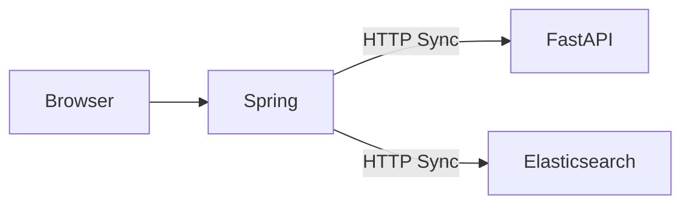
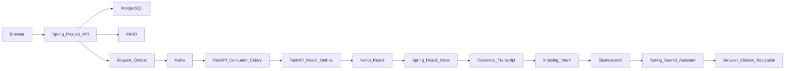

# Project2 to Project3 Evolution

## 1. Executive summary
The AI Knowledge Workspace started with an original search-first learning-video problem: enabling users to find and interact with exact moments inside long video or audio files. Project2 established the basic components: a Spring Boot backend, a FastAPI processing service, and Elasticsearch for retrieval. However, Project2 used a synchronous, tightly-coupled processing integration that lacked durability, idempotency, and asynchronous intent.

Project3 was needed to harden the architecture into a reliable distributed system. The final Project3 product is an integrated architecture with a Spring Modulith product core, an asynchronous Kafka-based FastAPI processing subsystem, explicit state ownership, and bounded failure recovery. The main engineering contribution is the transition from synchronous direct HTTP coupling to a transactional-outbox, asynchronous event-driven architecture with strong data ownership and idempotency boundaries.

## 2. Evidence and terminology
* **Project2:** The baseline proof-of-concept phase before asynchronous decoupling.
* **Project3:** The systematic architectural refactoring phase introducing Kafka, transactional outboxes, and strict module boundaries.
* **Product truth:** Canonical data owned by Spring and stored durably in PostgreSQL.
* **Derived state:** Data projected for optimization or secondary reads (e.g., Elasticsearch indices).
* **Compatibility path:** Retained direct HTTP integration endpoints in FastAPI, used for fallback and rollback during deprecation.
* **Static, runtime, and manual evidence:**
  * Static: confirmed by Git diff or code review.
  * Runtime: confirmed by logs, automated scripts, or observed integration flows.
  * Manual: confirmed by human interaction via browser testing.

Note: "Phase passed" indicates local integration and characterization success, not production-scale certification.

## 3. Project2 baseline
* **Exact baseline commit:** `e8662d3e706a08a590968460083c7cb12cb3a7c2` (Date: May 24, 2026).
* **Repository shape:** Tightly coupled Spring Boot controller-to-service flows, synchronous HTTP calls to FastAPI.
* **Supported product flow:** Upload file -> manual trigger of processing -> wait for completion -> explicit index transcript -> search.
* **Roles:** Spring (API gateway & product state), FastAPI (Direct transcription execution), Elasticsearch (Text retrieval).
* **Authentication model:** Incomplete, implicit stubs.
* **Persistence approach:** Basic PostgreSQL CRUD, without explicit event persistence.
* **Explicit-indexing behavior:** Manual REST triggers required to move transcripts from FastAPI to Elasticsearch.
* **Capabilities that did not exist:** Asynchronous processing intent, transactional outbox, automatic indexing, workspace isolation, MinIO object ownership, durable transcript snapshots, and a grounded AI assistant.
* **Known limitations:** Single point of failure during processing, duplicate media uploads, polling dependencies.

## 4. Why Project3 was started
Project3 addressed concrete gaps in Project2:
* **Direct synchronous processing coupling:** Long-running transcription blocked Spring HTTP threads.
* **Duplicate media/storage responsibility:** Both Spring and FastAPI managed binary media, causing drift.
* **Polling dependency:** Spring relied on polling FastAPI to check transcription status.
* **Absence of durable async intent:** Crashing mid-process lost the transcription request entirely.
* **Absence of result idempotency/recovery:** Retries resulted in duplicated processing or duplicate DB records.
* **Manually triggered indexing:** Users or scripts had to explicitly push transcripts to search.
* **Incomplete authentication path:** Lacked isolated workspaces and user-owned boundaries.
* **No grounded assistant:** No integrated LLM context mechanism mapped to transcripts.
* **Weak module boundaries:** Circular dependencies existed in the Spring monolith.
* **Limited operational resilience:** No defined failure cooldowns or DLQ strategies.

## 5. Chronological phase history

| Phase | Date Range | Repositories | Objective | Key Implementation | Representative Commits | Validation Evidence | Outcome & Remaining Debt |
|---|---|---|---|---|---|---|---|
| Project2 | Before May 24, 2026 | Spring, FastAPI | Baseline concept | Sync REST | `e8662d3` | Static/Manual | Unreliable sync flow |
| S1 - Foundation | Jun 2026 | Spring | Integrated product foundation | Workspace model, MinIO, Object references, Product API | `00737f5`, `4f4379c` | Static, Compilation | Initial DB/MinIO state defined |
| S2 - Async & Assistant | Jun 2026 | Spring, FastAPI | Asynchronous processing | Spring outbox, Kafka event, FastAPI consumer, Celery execution, Assistant citation | `dfbd08d` | Static, Runtime | Async established, citation limitations |
| S3 - Default & Obs | Jun/Jul 2026 | Spring, FastAPI | Coherent async default | `project3-up` profile, observation campaign, idempotency | `f54efaf`, `d00b011` | Runtime, 10-run pass | Verified default async, manual relay support |
| S4 - Resilience | Jul 2026 | Spring, FastAPI | Runtime resilience | Outbox retry classification, cooldown/cycle limits, transient/permanent failures | `a06a3d6` | Runtime drills | Cooldown bounds enforced |
| S5 - Architecture Refactor | Jul 2026 | Spring, FastAPI, Frontend | Strict Modulith & Ownership | Neutral outbox, eliminated cycles via consumer-owned ports, FastAPI 4-stage pipeline | `70cf897`, `f6a6d57` | Architecture tests passed | Zero Modulith violations, `project3-submission-v1` tag |

**Post-S5 final product hardening:**
Occurred after `project3-submission-v1` (`d6ea53d`).
* FastAPI concurrent schema-bootstrap advisory lock.
* Unsupported media validation before side effects (`9286fe4`).
* Workspace route hydration and controlled deletion dialog.
* Final strict modular-hexagonal architecture convergence (`70cf897`).
* Centralized user-safe error contract (`fbc1288`).
* Landing page and simplified learning-workspace UI.
* Focused search relevance (`cf92051`).
* Exact transcript-row navigation.
* Complete asset deletion semantics (`b510010`).
* Final manual acceptance and duplicate-context cleanup.

## 6. Architecture evolution

| Dimension | Project2 | Project3 |
|---|---|---|
| Topology | Distributed monolith (Sync HTTP) | Event-driven (Kafka/Outbox) |
| Product API Owner | Spring | Spring |
| Media Ownership | Split Spring/FastAPI | Spring (MinIO), FastAPI via pre-signed URL |
| Processing Trigger | Direct HTTP | Kafka Event |
| Result Delivery | Polling | Kafka Result Relay |
| Canonical Transcript | FastAPI | Spring Database |
| Indexing | Manual HTTP | Automatic via Spring event |
| Search | Basic Text | Filtered by Workspace/Asset |
| Assistant | None | Grounded with Citations |
| Authentication | Stubs | Keycloak JWT / Workspaces |
| Failure Handling | None | Retries, Cooldowns, Cycles |
| Module Boundaries | Tangled | Modulith, Ports & Adapters |
| Frontend Role | Demo UI | SPA, State Management, Polling lifecycle |
| Validation | Basic tests | Architecture tests, runtime observations |

## 7. Final module and ownership map
Final Spring modules: `workspace`, `asset`, `processing`, `search`, `assistant`, `identity`/`common`, `outbox`, `storage`, `integration`.
* **Modular monolith at system level:** Independent logical domains running in a single JVM.
* **DDD-oriented capabilities:** Bounded contexts for Asset Lifecycle vs Search vs Processing.
* **Ports and Adapters:** Core logic isolated from web/persistence frameworks.
* **Spring Modulith enforcement:** ArchUnit checks verify cyclic dependency absence and visibility rules.
* **Module API vs Application Port:** `api/` packages expose cross-module interfaces, implementation lives inside.
* **Consumer-owned output ports:** Core domain defines SPI interfaces, infrastructure layer implements them.
* **FastAPI as internal subsystem:** It processes heavy ML models asynchronously and communicates back via Kafka, never directly exposed as a public API to the browser.

## 8. Data ownership and state machines
* **PostgreSQL:** Product truth (Users, Workspaces, Assets, Transcripts).
* **FastAPI DB:** Scratch/delivery state (Processing requests, outbox rows).
* **MinIO:** Binary ownership.
* **Elasticsearch:** Derived state for text retrieval.
* **Redis/Celery:** Execution state.
* **Kafka:** Transport semantics (at-least-once).

Major State Machines:
* **Asset:** `PENDING_UPLOAD` -> `PROCESSING` -> `SEARCHABLE` / `FAILED`
* **ProcessingJob:** `DRAFT` -> `PROCESSING` -> `COMPLETED` / `FAILED`
* **Spring Request Outbox:** `PENDING` -> `PUBLISHED` -> `EXHAUSTED`
* **FastAPI Processing Request:** `accepted` -> `transcribing` -> `ready` / `failed`
* **FastAPI Result Outbox:** `PENDING` -> `PUBLISHED`
* **Spring Result Inbox:** Deduplicates consumption.
* **Search Indexing Job:** `PENDING` -> `COMPLETED`

## 9. Reliability and failure handling
* **Transactional outbox:** Prevents dual-write failures between database and Kafka.
* **At-least-once delivery:** Kafka guarantees delivery, relying on consumer idempotency.
* **Idempotency:** Unique identifiers and state checks prevent duplicate processing.
* **Deterministic identifiers:** UUIDs assigned early for safe retries.
* **Compare-and-set claims:** Concurrent modifications are protected by DB locks/versions.
* **Retries and cooldown:** Transient failures retry with delays.
* **Bounded recovery:** Max attempt cycles prevent infinite loops.
* **Duplicate prevention:** Deduplication inboxes ignore previously processed IDs.
* **Late result after asset deletion:** Inbox handles orphaned results gracefully without crashing.
* **Compatibility and operator recovery paths:** Manual API triggers retained for edge cases.

## 10. Product and UI evolution
* **Authentication:** Moved from hardcoded stubs to real login via Keycloak.
* **Home/Library/Search:** Logical categorization of content.
* **Upload lifecycle:** Clear progress and validation states.
* **Asset Study screen:** Centralized view of transcript and video.
* **Transcript-local search & Workspace search:** Broad and narrow retrieval.
* **Grounded assistant:** LLM generating answers with clickable citations.
* **Citation navigation:** Jump to exact video timestamp.
* **Responsive/mobile design:** Mobile viewport support.
* **Safe user-facing errors:** Raw exceptions are masked.
* **Progressive disclosure:** Technical states are abstracted to simple user terms.

## 11. Important defects and debugging lessons
| Symptom | Root Cause | Layer | Fix | Lesson |
|---|---|---|---|---|
| Relay publisher mismatch | Spring expected dict, got string | FastAPI -> Kafka | Standardize event codec | Transport boundaries require strict contracts |
| Empty transcript/indexing | Transcript parsed with wrong key | Integration | Fix JSON mapping | Validate derived state inputs before indexing |
| Kafka container exit/OOM | Missing resource limits | Docker | Allocate memory | Infrastructure requires limits |
| Concurrent FastAPI schema | Race condition on startup | FastAPI DB | Add advisory lock | DB init must be synchronized |
| Snake_case DTO regression | Jackson config mismatch | Spring API | Align casing | Cross-language APIs need explicit casing specs |
| .txt upload reached backend | Missing early extension check | API/Frontend | Reject at Spring layer | Validate early before side effects |
| Deep-link lost context | Missing workspace_id in URL | Frontend | Hydrate context in route | URLs must encapsulate state |
| Native delete confirm disappearing | React re-render unmounted element | Frontend | Lift state/use dialog | DOM state mapping must match React lifecycle |
| Raw backend errors reaching UI | Exception handler leaked traces | Spring Web | Centralized `@ControllerAdvice` | Safe error boundaries are critical |
| Weak search matches | Broad Elasticsearch query | Spring Search | Focus query/boosts | Relevance tuning is iterative |
| Asset deletion cleanup gaps | FK constraints & orphan objects | Spring Asset | Explicit cascading & MinIO delete | Multi-store deletions require orchestration |
| Exact transcript navigation not scrolling | DOM element not ready | Frontend | Add small delay/ref | Browser DOM lifecycle needs explicit sync |

## 12. Verification maturity
The project evolved from basic unit tests and stubs to:
* Unit and component tests.
* Golden HTTP/Kafka contracts.
* Transaction characterization verifying commit boundaries.
* Strict Spring Modulith and ArchUnit rules.
* FastAPI compile/import/config checks.
* Bounded runtime campaigns (10-run observations).
* Browser acceptance.
* Final manual regression.

## 13. Key commit and tag manifest

**Project2 baseline:**
| Repo | Commit | Description |
|---|---|---|
| Spring | `e8662d3` | Project2 |

**Original submission tags (`project3-submission-v1`):**
| Repo | Tag / Commit | Description |
|---|---|---|
| Spring | `d846277` (points to `d6ea53d`) | docs(project3): consolidate final submission baseline |
| FastAPI | `1bb878f` | - |
| Frontend | `b71e326` | - |

**Post-submission hardening commits (Spring):**
* `c76d9e8` docs(project3): align v1 architecture references
* `f6a6d57` refactor(integration): internalize FastAPI processing transports
* `7f42b77` refactor(architecture): expose intentional Spring module APIs
* `5ff9a65` refactor(architecture): internalize Spring module implementations
* `cb900c2` fix(integration): preserve FastAPI transcript artifact field mapping
* `9286fe4` fix(asset): reject unsupported media uploads
* `551c0ca` fix(integration): preserve FastAPI direct-upload field mapping
* `70cf897` refactor(architecture): finalize modular hexagonal boundaries
* `fbc1288` fix(errors): standardize user-safe API responses
* `cf92051` fix(search): return focused transcript matches
* `b510010` fix(asset): harden deletion cleanup

**Current final HEAD of each repository:**
* Spring: `b510010`
* FastAPI: `978476f`
* Frontend: `eecd42c`

## 14. Lessons learned
* Evolve architecture from observed coupling rather than diagrams alone.
* Define one product source of truth (PostgreSQL in Spring).
* Distinguish transport state from product state.
* Introduce async processing only with idempotency and recovery.
* Preserve compatibility until the replacement has runtime evidence.
* Refactor under characterization tests.
* Keep browser/API boundaries explicit.
* Treat manual acceptance as evidence distinct from automated tests.
* Avoid speculative abstractions.
* Optimize UI around user tasks rather than backend states.

## 15. Handoff toward graduation thesis
**Strongest continuation direction:**
Evolve AI Knowledge Workspace into an evaluated, grounded learning-video retrieval and assistant platform.

**Candidate research/engineering tracks:**
* Timestamp-aware media playback and citation navigation.
* Hybrid lexical/vector retrieval.
* Reranking and retrieval evaluation.
* Multilingual Vietnamese/English transcript quality.
* Grounded-answer evaluation and hallucination controls.
* Workspace collaboration and RBAC.
* Observability, SLOs and production deployment.
* Internal-service security.
* Cost/latency evaluation.

## 16. Report-ready appendix
* **Terminology glossary:** See section 2.
* **Final repository manifest:** Spring product core, FastAPI processing, React frontend.
* **Phase-to-report-chapter mapping:** S1-S5 translates to Architecture, Async Implementation, and Resilience chapters.
* **Suggested diagrams:** Final module map, Async state machine, System context.
* **Code-reading order:** Product API -> Outbox -> Kafka -> FastAPI -> Result Relay -> Inbox -> Canonical Snapshot -> Indexing -> Search -> Assistant.
* **Evidence:** Capture fresh logs of the 10-run observation before thesis submission.
